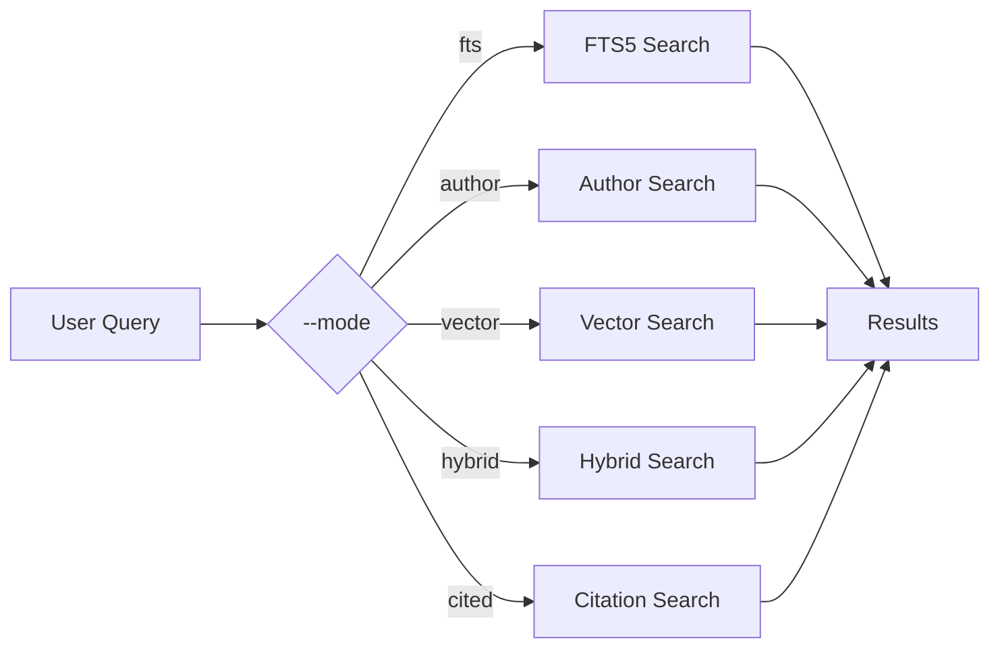
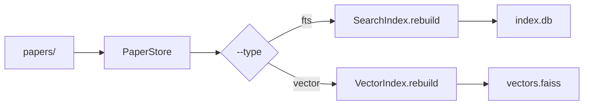
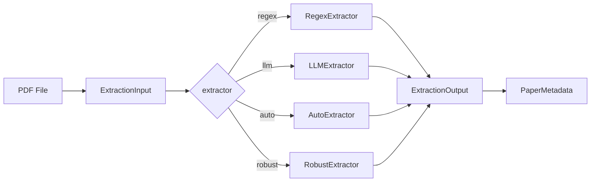

# Synapse Design

> Ideal architecture for a general-purpose local knowledge network.

---

## 1. Project Goal

**Synapse** is a local knowledge network that enables AI-powered research and knowledge management. It provides:

- **Unified knowledge base** with multiple workspaces
- **Layered content loading** (L1-L4) for progressive access
- **Semantic retrieval** via embeddings and vector search
- **Source-agnostic** paper ingestion from multiple formats

### Core Principles

| Principle | Description |
|-----------|-------------|
| Local-First | All data stored locally (privacy, offline capability) |
| AI-Native | Designed for AI coding agents with JSON output |
| Zero Config | Environment variables auto-detected, smart defaults |
| Functional Design | Pure functions, pipeline composition, dataclass-based state |

---

## 2. Architecture

### Layer Overview

```
┌─────────────────────────────────────────────────────────────────┐
│ Layer 3: Entry Points                                           │
│   ├── cli/          CLI commands                                │
│   ├── mcp.py        MCP server for AI agents                     │
│   └── export.py     BibTeX export                               │
├─────────────────────────────────────────────────────────────────┤
│ Layer 2: Features                                               │
│   ├── topics.py     BERTopic clustering                          │
│   └── sources/     PaperSource Protocol + implementations       │
├─────────────────────────────────────────────────────────────────┤
│ Layer 1: Core Data                                              │
│   ├── loader.py     L1-L4 layered loading                      │
│   ├── index/       FTS5 + FAISS search                         │
│   │   ├── text.py  Full-text search                             │
│   │   └── vector.py Semantic search                             │
│   └── extract.py    Metadata extraction (regex/LLM)             │
├─────────────────────────────────────────────────────────────────┤
│ Layer 0: Foundation                                              │
│   ├── config.py    Configuration loading & resolution           │
│   ├── log.py       Logging singleton                            │
│   ├── papers.py    PaperStore, metadata handling                 │
│   ├── audit.py     Data quality auditing                        │
│   ├── filters.py   Protocol-based filtering                     │
│   ├── llm.py       LLM client abstraction                       │
│   ├── http.py      HTTP client Protocol                         │
│   ├── mineru.py    PDF parsing (MinerU)                         │
│   └── metrics.py   Metrics collection                           │
└─────────────────────────────────────────────────────────────────┘
```

### Module Reference

| Module | Responsibility | Key Types |
|--------|---------------|-----------|
| `config.py` | Config loading, workspace resolution | `Config`, `WorkspaceConfig`, `IndexConfig`, `SourcesConfig` |
| `papers.py` | Paper storage, metadata CRUD | `PaperStore`, `PaperMetadata` |
| `index/text.py` | FTS5 full-text search | `SearchIndex`, `FilterParams` |
| `index/vector.py` | FAISS semantic search | `VectorIndex`, `FaissIndexConfig`, `Embedder` |
| `loader.py` | L1-L4 content loading | `PaperLoader`, `LoadResult` |
| `extract.py` | Metadata extraction | `Extractor`, `ExtractionInput`, `ExtractionOutput` |
| `topics.py` | Topic modeling | `TopicTrainer`, `TopicConfig`, `TopicModelOutput` |
| `sources/` | Data source integration | `PaperSource`, `LocalSource`, `OpenAlexSource` |

---

## 3. Workspace

Each workspace is an independent knowledge environment.

```
<workspace>/
├── workspace.json    # workspace metadata
├── index.db         # SQLite FTS5 index
├── papers/          # canonical paper storage
├── vectors.faiss    # FAISS vector index (optional)
└── topic_model/     # BERTopic model (optional)
```

### Configuration Resolution

Priority (top → bottom):

1. CLI argument (`--workspace`)
2. Environment variable (`SYNAPSE_WORKSPACE`)
3. Workspace-local config (`<workspace>/synapse.yml`)
4. Global config (`~/.synapse/config.yml`)
5. Built-in defaults

---

## 4. Layered Loading (L1-L4)

| Level | Content | Source | Access Pattern |
|-------|---------|--------|----------------|
| L1 | title, authors, year, journal, doi | `index.db` | Direct SQL query |
| L2 | abstract | `meta.json` | File read |
| L3 | structural sections | `chunks.jsonl` | LLM extraction |
| L4 | full markdown | `paper.md` | File read |

**Design Principle**: Metadata queries never require filesystem scanning.

---

## 5. Data Directory

```
papers/
└── <AuthorYear-ShortTitle>/
    ├── meta.json          # PaperMetadata (L1-L2)
    ├── paper.md          # Full text (L4)
    ├── chunks.jsonl      # Extracted sections (L3)
    └── images/           # Extracted figures
```

### meta.json Schema

```json
{
  "id": "<uuid>",
  "title": "...",
  "authors": [...],
  "year": 2024,
  "journal": "...",
  "doi": "...",
  "abstract": "...",
  "source": "local|openalex|zotero|endnote"
}
```

- `id`: Stable UUID (never changes)
- Directory names are human-readable and may change
- UUID in metadata remains stable across renames

---

## 6. Context State

### Config Context

The `Config` object is the central context provider:

```python
@dataclass
class Config:
    workspace: WorkspaceConfig       # Current workspace identity
    workspace_store: dict[str, WorkspaceConfig]  # All workspaces
    sources: SourcesConfig          # Data source settings
    index: IndexConfig             # Search & embedding config
    llm: LLMConfig                 # LLM API settings
    ingest: IngestConfig           # PDF processing config
    topics: TopicsConfig           # Topic modeling config
    log: LogConfig                 # Logging config
    _root: Path                    # Root directory
```

### Path Properties

| Property | Returns |
|----------|---------|
| `config.root` | Project root path |
| `config.workspace_dir` | Workspace directory |
| `config.papers_dir` | Papers storage |
| `config.index_db` | SQLite database path |
| `config.vectors_file` | FAISS index path |

### PaperStore Context

```python
class PaperStore:
    """Paper storage with optional caching."""
    
    papers_dir: Path
    
    def iter_papers(self) -> Iterator[Path]: ...
    def read_meta(self, paper_d: Path) -> dict: ...
    def read_md(self, paper_d: Path) -> str | None: ...
    def audit(self) -> list[Issue]: ...
```

### Search Index Context

```python
# FTS Index
with SearchIndex(cfg.index_db) as idx:
    results = idx.search(query, top_k=20)

# Vector Index  
with VectorIndex(cfg.index_db) as vidx:
    results = vidx.search(query, top_k=10)
```

---

## 7. Workflows

### Search Workflow



### Index Building Workflow



### Data Extraction Pipeline



---

## 8. CLI Commands

### Unified Command Structure

| Command | Flags | Description |
|---------|-------|-------------|
| `search` | `--mode fts\|author\|vector\|hybrid\|cited` | Search papers |
| `index` | `--type fts\|vector` | Build search index |
| `audit` | `--severity error\|warning\|info` | Data quality audit |
| `check` | - | Quick diagnostics |
| `doctor` | - | Full health check |
| `init` | `--force` | Setup wizard |
| `metrics` | `--summary\|--last N` | Show LLM metrics |

### Usage Examples

```bash
# Search
synapse search "turbulence"
synapse search "John Smith" --mode author
synapse search "machine learning" --mode vector

# Index
synapse index              # Build FTS
synapse index --type vector --rebuild

# Audit
synapse audit --severity error

# Diagnostics
synapse check
synapse doctor
```

---

## 9. Data Sources

### PaperSource Protocol

All sources implement unified interface:

```python
class PaperSource(Protocol):
    @property
    def name(self) -> str: ...
    
    def fetch(self, **kwargs) -> Iterator[dict]: ...
    
    def count(self, **kwargs) -> int: ...
```

### Implementations

| Source | Description | Protocol Method |
|--------|-------------|-----------------|
| `LocalSource` | Scan workspace papers/ | `fetch(papers_dir)` |
| `OpenAlexSource` | OpenAlex API | `fetch(issn, year_range)` |
| `ZoteroSource` | Zotero library | `fetch(library_id, api_key)` |
| `EndnoteSource` | EndNote XML/RIS | `fetch(paths)` |

---

## 10. Configuration Schema

### WorkspaceConfig

```python
@dataclass(frozen=True)
class WorkspaceConfig:
    name: str = "default"
    description: str = ""
    root: str = ""  # Optional override
```

### IndexConfig

```python
@dataclass(frozen=True)
class IndexConfig:
    top_k: int = 20
    embed_model: str = "Qwen/Qwen3-Embedding-0.6B"
    embed_device: str = "auto"
    chunk_size: int = 800
    chunk_overlap: int = 150
```

### SourcesConfig

```python
@dataclass(frozen=True)
class SourcesConfig:
    local: LocalSourceConfig
    openalex: OpenAlexSourceConfig
    zotero: ZoteroSourceConfig
    endnote: EndnoteSourceConfig
```

---

## 11. Key Design Patterns

### Data Pipe Flow

```
ImmutableInput → Stage1 → ImmutableResult → Stage2 → ImmutableResult → Output
```

All intermediate results are frozen dataclasses. No mutable state passed between stages.

### Context Injection

Instead of passing paths directly, use context objects:

```python
# Instead of
def search(query: str, db_path: Path, papers_dir: Path): ...

# Use
def search(query: str, index: SearchIndex, store: PaperStore): ...
```

### Protocol-Based DI

```python
class PDFClient(Protocol):
    def call(self, pdf_path: Path, opts: ParseOptions) -> dict: ...

class LLMClient(Protocol):
    def complete(self, request: LLMRequest) -> LLMResult: ...
```

---

## 12. Environment Variables

| Variable | Description |
|----------|-------------|
| `SYNAPSE_WORKSPACE` | Active workspace name |
| `SYNAPSE_LLM_API_KEY` | LLM API key |
| `DEEPSEEK_API_KEY` | DeepSeek API key (fallback) |
| `OPENAI_API_KEY` | OpenAI API key (fallback) |
| `MINERU_API_KEY` | MinerU cloud API key |
| `ZOTERO_API_KEY` | Zotero API key |
| `ZOTERO_LIBRARY_ID` | Zotero library ID |
