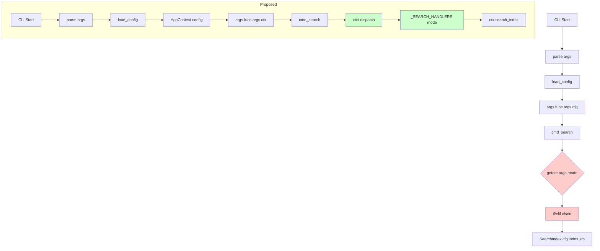

# CLI Commands Refactoring Plan

> Comprehensive analysis of `linkora/cli/` with improvements for boilerplate reduction, proper naming, and better workflow.
> Based on `docs/AGENT.md` standards.

---

## 1. Issues Identified

### 1.1 AGENT.md Violations (High Priority)

| Location | Issue | AGENT.md Rule |
|----------|-------|---------------|
| `commands.py:65-83` | `getattr(args, "mode", "fts")` + if/elif chain | "No getattr for dispatch" |
| `commands.py:150-151` | `getattr(args, "type", "fts")` + if/elif chain | "No getattr for dispatch" |
| `commands.py:54,143,184,etc.` | `cfg` parameter without type hint | "Type safety: Full type hints" |
| `commands.py:253-257` | Chinese UI messages | "CLI output: English" |

### 1.2 Boilerplate Issues

| Location | Issue |
|----------|-------|
| `commands.py:64-69` | Repeated `getattr(args, "x", None)` for filter args |
| `commands.py:86-136` | 5 `_search_*` functions with nearly identical structure |
| `commands.py:107,168,204,etc.` | Inline imports scattered - should organize |
| `commands.py:336` | `--fix` argument defined but never used |

### 1.3 Vague/Redundant Commands

| Command | Issue |
|---------|-------|
| `search --mode fts` | "fts" is vague - should be "fulltext" or removed |
| `search --mode cited` | Should be separate `top-cited` command |
| `cmd_setup` | Duplicate of `cmd_init` |
| `cmd_check`, `cmd_doctor` | Overlapping functionality |

---

## 2. Completed Items (from previous plan)

### 2.1 Logging Pattern ✅

| Location | Before | After |
|----------|--------|-------|
| `commands.py:15` | `_log = logging.getLogger(__name__)` | `_log = get_logger(__name__)` |

### 2.2 Command Consolidation ✅

**Before (10 commands):**
```
search, search-author, vsearch, usearch, top-cited, index, embed, audit, setup, metrics
```

**After (clean):**
```
search --mode fulltext|author|vector|hybrid
top-cited
index --type fts|vector
audit
doctor
metrics
```

---

## 3. New Improvements Required

### 3.1 Remove Vague "fts" Mode

**Current:**
```bash
linkora search "query"           # defaults to fts
linkora search "query" --mode fts  # vague "fts"
```

**Proposed:**
```bash
linkora search "query"            # defaults to fulltext
linkora search "query" --mode fulltext  # explicit
linkora search "query" --mode author
linkora search "query" --mode vector
linkora search "query" --mode hybrid
linkora top-cited                  # separate command
```

**Changes:**
- Rename `fts` to `fulltext` for clarity
- Make `cited` a separate top-level command (`top-cited`)
- Remove `search --mode` as default (no flag = fulltext search)

### 3.2 Replace getattr Dispatch with Dictionary (AGENT.md)

**Current (violates AGENT.md):**
```python
mode: SearchMode = getattr(args, "mode", "fts")
if mode == "fts":
    _search_fts(...)
elif mode == "author":
    _search_author(...)
```

**Proposed (per AGENT.md):**
```python
_SEARCH_HANDLERS: dict[SearchMode, Callable] = {
    "fulltext": _search_fulltext,
    "author": _search_author,
    "vector": _search_vector,
    "hybrid": _search_hybrid,
}

def cmd_search(args: argparse.Namespace, ctx: AppContext) -> None:
    mode: SearchMode = args.mode
    handler = _SEARCH_HANDLERS.get(mode, _search_fulltext)
    handler(ctx, query, top_k, filters)
```

### 3.3 Add Type Hints to Command Functions

**Current:**
```python
def cmd_search(args: argparse.Namespace, cfg) -> None:
```

**Proposed:**
```python
def cmd_search(args: argparse.Namespace, ctx: AppContext) -> None:
```

### 3.4 Integrate AppContext into Commands

**Current:** Direct `cfg` passed to functions
```python
args.func(args, cfg)
```

**Proposed:** Wrap with AppContext
```python
ctx = AppContext(config)
try:
    args.func(args, ctx)
finally:
    ctx.close()
```

### 3.5 Extract Common Search Helper

**Current:** 5 functions with duplicated patterns
```python
def _search_fts(cfg, query, top_k, year, journal, paper_type):
    with SearchIndex(cfg.index_db) as idx:
        results = idx.search(...)
    print_results_list(results, ...)

def _search_author(cfg, query, top_k, year, journal, paper_type):
    with SearchIndex(cfg.index_db) as idx:
        results = idx.search_author(...)
    print_results_list(results, ...)
```

**Proposed:** Single helper with method injection
```python
def _run_search(
    ctx: AppContext,
    query: str,
    top_k: int,
    filters: dict,
    search_method: str = "search",
    mode_label: str = "fulltext",
) -> None:
    """Common search execution pattern."""
    with ctx.search_index() as idx:
        method = getattr(idx, search_method)
        results = method(query, top_k=top_k, **filters)
    print_results_list(results, f"Found {len(results)} papers ({mode_label}: \"{query}\")")
```

### 3.9 Consolidate Duplicate Commands

The current CLI has significant duplication:

| Command | Duplicates | Solution |
|---------|-----------|----------|
| `setup check` | `check` (top-level) | Keep only `doctor --light` |
| `setup wizard` | `init` | Keep only `init` |
| `cmd_check` | `cmd_doctor` | Merge into `doctor --light` |
| `cmd_setup` | `cmd_init` | Remove `cmd_setup` |

**Current code issues:**
```python
# commands.py - Multiple overlapping commands
p = subparsers.add_parser("setup", help="Setup wizard")
p.set_defaults(func=cmd_setup)
p_sub = p.add_subparsers(dest="action")
p_sub.add_parser("check", help="Check environment")  # duplicates 'check' command
p_sub.add_parser("wizard", help="Interactive setup wizard")  # duplicates 'init' command

p = subparsers.add_parser("check", help="Quick environment diagnostics (no network)")  # duplicate
p.set_defaults(func=cmd_check)

p = subparsers.add_parser("init", help="Interactive setup wizard")  # duplicate
p.set_defaults(func=cmd_init)
```

**Proposed consolidation:**
```python
# Remove: setup (with check/wizard subcommands), check (top-level)
# Keep: init, doctor (with --light flag)

p = subparsers.add_parser("init", help="Interactive setup wizard")
p.set_defaults(func=cmd_init)
p.add_argument("--force", action="store_true", help="Force overwrite")

p = subparsers.add_parser("doctor", help="Health check")
p.set_defaults(func=cmd_doctor)
p.add_argument("--light", action="store_true", help="Quick check (no network)")
p.add_argument("--fix", action="store_true", help="Auto-fix issues")
```

### 3.7 Fix --fix Argument in Audit

**Current:** Argument defined but unused
```python
p.add_argument("--fix", action="store_true", help="Auto fix")

def cmd_audit(args: argparse.Namespace, ctx: AppContext) -> None:
    # ... no args.fix handling
```

**Proposed:** Implement fix functionality
```python
def cmd_audit(args: argparse.Namespace, ctx: AppContext) -> None:
    issues = ctx.paper_store().audit()
    if args.fix:
        fixed = _auto_fix_issues(ctx.paper_store(), issues)
        ui(f"Fixed {fixed} issues")
```

### 3.8 English UI Messages Only

**Current:** Mixed English/Chinese
```python
ui(f"LLM 调用次数: {summary.call_count}")  # Chinese
print_results_list(results, f'Found {len(results)} papers')  # English
```

**Proposed:** Consistent English per AGENT.md
```python
ui(f"Found {len(results)} papers")
ui(f"LLM calls: {summary.call_count}")
```

---

## 4. Implementation Checklist

### Phase 1: AGENT.md Violations
- [ ] Replace getattr dispatch with dictionary in cmd_search
- [ ] Replace getattr dispatch with dictionary in cmd_index
- [ ] Add type hints to all cmd_* functions
- [ ] Use English only for all UI messages

### Phase 2: Command Cleanup
- [ ] Rename `fts` to `fulltext` in search modes
- [ ] Create separate `top-cited` command
- [ ] Remove `cmd_setup` (keep `cmd_init`)
- [ ] Remove `cmd_check` (use `doctor --light`)

### Phase 3: AppContext Integration
- [ ] Update __init__.py to create AppContext
- [ ] Modify cmd_* functions to accept AppContext instead of cfg
- [ ] Use ctx.search_index() instead of direct SearchIndex()
- [ ] Use ctx.paper_store() instead of direct PaperStore()

### Phase 4: Boilerplate Reduction
- [ ] Extract _run_search helper
- [ ] Extract _run_index helper
- [ ] Move inline imports to top-level with try/except for optional deps

### Phase 5: Bug Fixes
- [ ] Implement --fix for audit command

### Phase 6: Quality
- [ ] Run `uv run ruff check --fix`
- [ ] Run `uv run ruff format`
- [ ] Run `uv run ty check` (if available)
- [ ] Test CLI commands work

---

## 5. Final CLI Commands

```
search [query] --mode fulltext|author|vector|hybrid  # fulltext is default
top-cited [--year Y] [--journal J] [--type T]
index --type fts|vector [--rebuild]
audit [--severity error|warning|info] [--fix]
doctor [--light] [--fix]
init [--force]
metrics [--last N] [--category C] [--since ISO] [--summary]
```

**Removed duplicates:**
- `setup` (with check/wizard subcommands) - removed
- `check` (top-level command) - removed, use `doctor --light`

---

## 6. File Changes Summary

| File | Changes |
|------|---------|
| `linkora/cli/__init__.py` | Create AppContext, use it for command execution |
| `linkora/cli/commands.py` | All improvements: dispatch dict, type hints, helpers, English UI, remove legacy |
| `linkora/cli/context.py` | May need additions for audit fix support |

---

## 7. Mermaid: Current vs Proposed Flow



---

## 8. Backward Compatibility Notes

Breaking changes:
- `search --mode fts` → `search --mode fulltext` or just `search`
- `search --mode cited` → `top-cited` (new command)
- `setup check` → `doctor --light`
- `setup wizard` → `init`
- `check` (top-level) → removed, use `doctor --light`
- `setup` (parent command) → removed entirely
