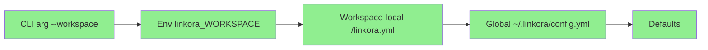

# Config & Design Improvement Summary

> Summary of current state and improvements based on codebase analysis.

---

## 1. Config Module - Current State (Well Implemented)

### 1.1 Implemented Features ✅

| Feature | Status | Location |
|---------|--------|----------|
| WorkspaceConfig | ✅ Complete | config.py:33-36 |
| LocalSourceConfig | ✅ Complete | config.py:39-43 |
| SourcesConfig | ✅ Complete | config.py:69-75 |
| IndexConfig | ✅ Complete | config.py:78-87 |
| LLMConfig | ✅ Complete | config.py:90-111 |
| IngestConfig | ✅ Complete | config.py:114-121 |
| TopicsConfig | ✅ Complete | config.py:124-128 |
| LogConfig | ✅ Complete | config.py:131-137 |
| resolve_local_source_paths() | ✅ Complete | config.py:563-593 |
| Layered resolution | ✅ Complete | config.py:1-9 (docstring) |
| API key resolution | ✅ Complete | config.py:102-111 |

### 1.2 Config Path Resolution Flow



---

## 2. Filters Module - Current State (Well Implemented)

### 2.1 Implemented Features ✅

| Feature | Status | Location |
|---------|--------|----------|
| parse_year_range() | ✅ Complete | filters.py:23-70 |
| _year_matches() | ✅ Complete | filters.py:73-104 |
| QueryFilter | ✅ Complete | filters.py:112-175 |
| Protocol Pattern | ✅ Complete | filters.py:118-123 |

---

## 3. Papers Module - Current State (Well Implemented)

### 3.1 Implemented Features ✅

| Feature | Status | Location |
|---------|--------|----------|
| PaperMetadata | ✅ Complete | papers.py:27-79 |
| Issue | ✅ Complete | papers.py:86-93 |
| YearRange | ✅ Complete | papers.py:96-110 |
| PaperFilter Protocol | ✅ Complete | papers.py:118-123 |
| Audit rules | ✅ Complete | papers.py:135-200 |
| PaperStore | ✅ Complete | papers.py:200-400 |

---

## 4. CLI Context - Current State (Well Implemented)

### 4.1 Implemented Features ✅

| Feature | Status | Location |
|---------|--------|----------|
| AppContext | ✅ Complete | context.py:38-46 |
| http_client() | ✅ Complete | context.py:52-58 |
| llm_runner() | ✅ Complete | context.py:60-70 |
| paper_store() | ✅ Complete | context.py:72-78 |
| search_index() | ✅ Complete | context.py:80-84 |
| vector_index() | ✅ Complete | context.py:86-93 |
| paper_enricher() | ✅ Complete | context.py:95-106 |
| source_dispatcher() | ✅ Complete | context.py:108-120 |

---

## 5. Design Documentation Updates

### 5.1 Update Required: docs/design.md

The design.md should be updated to reflect:

1. **Multi-path support is implemented** ✅
   - `resolve_local_source_paths()` in config.py
   - `LocalSource(pdf_dirs=list[Path])` in sources/local.py
   - `DefaultDispatcher(local_pdf_dirs=list[Path])` in ingest/matching.py
   - `ctx.source_dispatcher()` in cli/context.py

2. **Filter consistency** ✅
   - QueryFilter in filters.py
   - FilterParams in index/text.py
   - Both use same parse_year_range() function

### 5.2 Design Changes Reflected

| Design.md Section | Current Status | Action |
|-------------------|---------------|--------|
| Phase 1: Fix Broken Code | ✅ Done | Update docs |
| Phase 2: Update LocalSource | ✅ Done | Update docs |
| Phase 3: Update Dispatcher | ✅ Done | Update docs |
| Phase 4: Update Context | ✅ Done | Update docs |

---

## 6. Recommended Documentation Updates

### 6.1 Update docs/design.md

Add "Implementation Status" section:

```markdown
## Implementation Status

| Feature | Status | Files |
|---------|--------|-------|
| Multi-path local sources | ✅ Implemented | config.py, sources/local.py, cli/context.py |
| QueryFilter | ✅ Implemented | filters.py |
| AppContext | ✅ Implemented | cli/context.py |
| Layered config | ✅ Implemented | config.py |
```

### 6.2 Update docs/config.md

Add `resolve_local_source_paths()` to API reference:

```markdown
## Python API (Updated)

```python
# New method for multi-path support
cfg.resolve_local_source_paths()  # Returns list[Path]
```
```

---

## 7. Summary

| Category | Status |
|----------|--------|
| Config Module | ✅ Well Implemented |
| Filters Module | ✅ Well Implemented |
| Papers Module | ✅ Well Implemented |
| CLI Context | ✅ Well Implemented |
| Design Documentation | ⚠️ Needs Update |
| Test Coverage | ⚠️ Needs New Tests |

**Overall**: Core functionality is well implemented. Documentation and test coverage for new functionalities (multi-path support) need attention.
