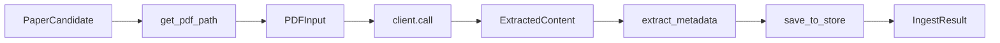

# Connection Plan: mineru.py, papers.py, and ingest.py (REFACTORED)

> Refactored plan based on user feedback:
> - Remove useless functions, use data pipe consuming flow
> - Types already given, no need for additional creator or class
> - Remove factory function or nested call function
> - Download function is blocked and inefficient

---

## 1. Current Issues (to fix)

| Issue | Location | Problem |
|-------|----------|---------|
| Factory function | [`_create_parser()`](linkora/ingest_pipeline.py:77) | Creates parser internally, hides client selection |
| Class overhead | [`IngestPipeline`](linkora/ingest_pipeline.py:43) | Lazy init, properties, unnecessary abstraction |
| Blocking download | [`download_pdf()`](linkora/ingest_download.py:17) | Synchronous, fixed 120s timeout |
| Dict conversion | [`process_candidate()`](linkora/ingest_pipeline.py:250) | Uses `candidate.get("field")` instead of typed `PaperCandidate` |

---

## 2. Refactored Data Flow

### 2.1 New Pipeline (Functional Data Pipe)



### 2.2 Key Changes

1. **Remove `IngestPipeline` class** → Use functional approach with types directly
2. **Remove `create_parser()` factory** → Accept `PDFClient` as parameter
3. **Use `PaperCandidate` directly** → No dict conversion needed
4. **Improve download** → Streaming, better timeout handling

---

## 3. Implementation Plan

### Phase 1: Refactor ingest_pipeline.py

**File**: `linkora/ingest_pipeline.py` (REWRITE)

```python
"""ingest_pipeline.py — Functional data pipe for paper ingestion.

Uses types directly from mineru module, no factory functions.
"""

from pathlib import Path

from linkora.ingest_types import IngestResult
from linkora.ingest_download import get_pdf_path
from linkora.mineru import (
    PDFInput,
    LocalClient,
    ParseOptions,
    PDFClient,
)
from linkora.papers import PaperStore, PaperMetadata, generate_uuid
from linkora.sources.protocol import PaperCandidate
from linkora.log import get_logger

_log = get_logger(__name__)


# Default parse options
_DEFAULT_PARSE_OPTIONS = ParseOptions(
    backend="pipeline",
    lang="en",
    formula_enable=True,
    table_enable=True,
)


def ingest(
    candidate: PaperCandidate,
    client: PDFClient,
    papers_dir: Path,
    http_client: HTTPClient | None = None,
    parse_options: ParseOptions | None = None,
) -> IngestResult:
    """Process candidate through data pipe consuming flow.
    
    Pipeline (consuming types directly):
        1. PaperCandidate → PDF path (download or cache)
        2. PDF path → PDFInput
        3. PDFInput → client.call() → ExtractedContent
        4. ExtractedContent → PaperMetadata
        5. PaperMetadata → saved to PaperStore
    
    Args:
        candidate: Paper candidate from source
        client: PDFClient (LocalClient or CloudClient)
        papers_dir: Target directory for papers
        http_client: HTTP client for downloading PDFs
        parse_options: MinerU parse options
        
    Returns:
        IngestResult with success/failure info
    """
    opts = parse_options or _DEFAULT_PARSE_OPTIONS
    
    try:
        # Stage 1: Get PDF path
        pdf_path = get_pdf_path(candidate, papers_dir, http_client)
        if pdf_path is None:
            return IngestResult(
                paper_id=candidate.id,
                title=candidate.title,
                doi=candidate.doi,
                success=False,
                error="No PDF available",
            )
        
        # Stage 2: Create PDFInput and call API (data pipe)
        pdf_input = PDFInput(pdf_path=pdf_path, opts=opts)
        
        # Consume: PDFInput → API response dict
        response = client.call(pdf_path, opts)
        
        # Stage 3: Extract markdown from response
        md_content = _extract_markdown(response)
        if md_content is None:
            return IngestResult(
                paper_id=candidate.id,
                title=candidate.title,
                doi=candidate.doi,
                success=False,
                error="Failed to extract markdown",
            )
        
        # Stage 4: Extract metadata
        metadata = _extract_metadata(md_content, candidate)
        
        # Stage 5: Save to store
        result = _save_to_store(metadata, md_content, papers_dir)
        _log.info("Ingested: %s", result.title)
        return result
        
    except Exception as e:
        _log.exception("Ingest failed for %s", candidate.id)
        return IngestResult(
            paper_id=candidate.id,
            title=candidate.title,
            doi=candidate.doi,
            success=False,
            error=str(e),
        )


def _extract_markdown(data: dict) -> str | None:
    """Extract markdown from API response dict."""
    if not isinstance(data, dict):
        return None
        
    # Primary: results -> {filename} -> md_content
    results = data.get("results")
    if isinstance(results, dict):
        for entry in results.values():
            if isinstance(entry, dict) and (md := entry.get("md_content")):
                if isinstance(md, str) and md.strip():
                    return md
    
    # Fallback: direct md_content
    for key in ("md_content", "md", "markdown", "content"):
        if (value := data.get(key)) and isinstance(value, str) and value.strip():
            return value
            
    return None


def _extract_metadata(md_content: str, candidate: PaperCandidate) -> PaperMetadata:
    """Extract metadata from markdown, merge with candidate."""
    from linkora.extract import (
        ExtractionInput,
        ExtractionContext,
        extract_regex,
        merge_to_output,
    )
    
    # Extract using regex
    input = ExtractionInput.from_text(
        name=candidate.title or "unknown",
        text=md_content,
    )
    ctx_extraction = ExtractionContext(input=input)
    ctx_extraction = extract_regex(ctx_extraction)
    output = merge_to_output(ctx_extraction)
    meta = output.metadata
    
    # Merge with candidate data (prefer source data)
    if candidate.doi and not meta.doi:
        meta.doi = candidate.doi
    if candidate.title and not meta.title:
        meta.title = candidate.title
    if candidate.authors:
        meta.authors = candidate.authors
    if candidate.year:
        meta.year = candidate.year
    if candidate.journal:
        meta.journal = candidate.journal
        
    # Generate ID if needed
    if not meta.id:
        meta.id = generate_uuid()
        
    return meta


def _save_to_store(
    metadata: PaperMetadata,
    md_content: str,
    papers_dir: Path,
) -> IngestResult:
    """Save paper to store."""
    store = PaperStore(papers_dir)
    
    # Generate directory name
    dir_name = _generate_dir_name(metadata)
    paper_d = papers_dir / dir_name
    
    # Handle duplicates
    if paper_d.exists():
        dir_name = f"{dir_name}_{metadata.id[:8]}"
        paper_d = papers_dir / dir_name
    
    paper_d.mkdir(parents=True, exist_ok=True)
    
    # Write metadata
    meta_dict = {
        "id": metadata.id,
        "title": metadata.title,
        "authors": metadata.authors,
        "first_author": metadata.first_author,
        "first_author_lastname": metadata.first_author_lastname,
        "year": metadata.year,
        "doi": metadata.doi,
        "journal": metadata.journal,
        "abstract": metadata.abstract,
        "paper_type": metadata.paper_type,
        "source_file": metadata.source_file,
    }
    store.write_meta(paper_d, meta_dict)
    
    # Write markdown
    md_path = paper_d / "paper.md"
    md_path.write_text(md_content, encoding="utf-8")
    
    return IngestResult(
        paper_id=metadata.id,
        title=metadata.title,
        doi=metadata.doi,
        success=True,
        pdf_path=None,
        md_path=md_path,
    )


def _generate_dir_name(meta: PaperMetadata) -> str:
    """Generate directory name from metadata."""
    import re
    from linkora.hash import compute_content_hash
    
    lastname = meta.first_author_lastname or "unknown"
    year = str(meta.year) if meta.year else "unknown"
    lastname = re.sub(r"[^a-zA-Z]", "", lastname) or "unknown"
    title_hash = compute_content_hash(meta.title)[:4]
    
    return f"{lastname}_{year}_{title_hash}"


__all__ = ["ingest"]
```

### Phase 2: Improve download (ingest_download.py)

**File**: `linkora/ingest_download.py` (IMPROVE)

Key improvements:
1. **Handle local PDFs directly** - Local source sets `pdf_url` to absolute path, use it without downloading
2. Streaming download for remote URLs
3. Better timeout handling
4. Retry logic

```python
"""ingest_download.py — PDF download utilities (improved).

Key improvements:
- Handle local PDFs directly (no download needed)
- Streaming download for large files
- Configurable timeouts
- Retry logic
"""

from __future__ import annotations

import hashlib
import os
from pathlib import Path

from linkora.http import HTTPClient
from linkora.log import get_logger
from linkora.sources.protocol import PaperCandidate

_log = get_logger(__name__)

# Configurable settings
DEFAULT_TIMEOUT = 60  # seconds
MAX_RETRIES = 3
CHUNK_SIZE = 8192


def get_pdf_path(
    candidate: PaperCandidate,
    papers_dir: Path,
    http_client: HTTPClient | None,
) -> Path | None:
    """Get PDF path - use local or download from URL.
    
    Key logic:
    - If pdf_url is a local path (file exists), use it directly
    - If pdf_url is HTTP URL, download to cache
    - Check cache before downloading
    
    Args:
        candidate: Paper candidate with pdf_url
        papers_dir: Papers directory for cache location
        http_client: HTTP client for downloading PDFs
        
    Returns:
        Path to PDF, or None if not available
    """
    pdf_url = candidate.pdf_url
    
    if not pdf_url:
        return None
    
    # Case 1: Local file path - use directly (no download needed)
    local_path = _try_local_path(pdf_url)
    if local_path and local_path.exists():
        _log.debug("Using local PDF: %s", local_path)
        return local_path
    
    # Case 2: Remote URL - download with caching
    if not http_client:
        return None
    
    # Skip non-HTTP URLs
    if not pdf_url.startswith("http://") and not pdf_url.startswith("https://"):
        return None
    
    cache_dir = papers_dir.parent / "cache" / "pdfs"
    cache_dir.mkdir(parents=True, exist_ok=True)
    
    # Check cache first
    cached = get_cached_pdf(pdf_url, cache_dir)
    if cached:
        return cached
    
    # Download with streaming
    return download_pdf(pdf_url, cache_dir, http_client)


def _try_local_path(url_or_path: str) -> Path | None:
    """Check if url_or_path is actually a local file path.
    
    Local source sets pdf_url to absolute path like C:\\... or /home/...
    """
    # Check if it's an absolute path
    if os.path.isabs(url_or_path):
        path = Path(url_or_path)
        if path.exists() and path.is_file():
            return path
    
    # Check if it's a relative path from workspace
    path = Path(url_or_path)
    if path.exists() and path.is_file():
        return path.resolve()
    
    return None


def get_cached_pdf(pdf_url: str, cache_dir: Path) -> Path | None:
    """Check if PDF is cached."""
    url_hash = hashlib.md5(pdf_url.encode()).hexdigest()[:12]
    cached_path = cache_dir / f"{url_hash}.pdf"
    
    if cached_path.exists():
        return cached_path
    return None


def download_pdf(
    url: str,
    target_dir: Path,
    http_client: HTTPClient,
    timeout: int = DEFAULT_TIMEOUT,
) -> Path | None:
    """Download PDF with streaming and retry logic."""
    import time
    
    url_hash = hashlib.md5(url.encode()).hexdigest()[:12]
    target_path = target_dir / f"{url_hash}.pdf"
    
    if target_path.exists():
        return target_path
    
    # Retry loop
    for attempt in range(MAX_RETRIES):
        try:
            # Use streaming download
            resp = http_client.get(url, timeout=timeout, stream=True)
            if resp.status_code != 200:
                _log.debug("HTTP %s for %s", resp.status_code, url)
                return None
            
            # Stream to file
            with open(target_path, "wb") as f:
                for chunk in resp.iter_content(chunk_size=CHUNK_SIZE):
                    if chunk:
                        f.write(chunk)
            
            _log.debug("Downloaded: %s", target_path.name)
            return target_path
            
        except Exception as e:
            _log.debug("Download attempt %s failed: %s", attempt + 1, e)
            # Clean up partial file
            if target_path.exists():
                try:
                    target_path.unlink()
                except Exception:
                    pass
            
            # Exponential backoff
            if attempt < MAX_RETRIES - 1:
                time.sleep(2 ** attempt)
    
    return None


__all__ = ["get_pdf_path", "get_cached_pdf", "download_pdf"]
```

### Phase 3: Update ingest_types.py

**File**: `linkora/ingest_types.py` (SIMPLIFY)

Keep only `IngestResult` - other types come from mineru module:

```python
"""ingest_types.py — Simplified types for ingestion.

Only IngestResult needed here - other types from mineru module.
"""

from __future__ import annotations

from dataclasses import dataclass
from pathlib import Path


@dataclass(frozen=True)
class IngestResult:
    """Final result of paper ingestion."""

    paper_id: str
    title: str
    doi: str
    success: bool
    error: str | None = None
    pdf_path: Path | None = None
    md_path: Path | None = None


__all__ = ["IngestResult"]
```

### Phase 4: Usage Example

```python
"""Example usage of refactored pipeline."""

from pathlib import Path
from linkora.mineru import LocalClient, ParseOptions
from linkora.ingest_pipeline import ingest
from linkora.sources.protocol import PaperCandidate

# Create client directly (no factory)
client = LocalClient(http_client=my_http_client)

# Or cloud client
# client = CloudClient(api_key=api_key, http_client=my_http_client)

# Process candidate directly
result = ingest(
    candidate=PaperCandidate(
        id="doi:10.1234/example",
        doi="10.1234/example",
        title="Example Paper",
        authors=["John Doe"],
        source="openalex",
        pdf_url="https://example.com/paper.pdf",
    ),
    client=client,
    papers_dir=Path("./papers"),
    http_client=my_http_client,
)

if result.success:
    print(f"Saved to: {result.md_path}")
```

---

## 4. File Changes Summary

| File | Action |
|------|--------|
| `linkora/ingest_pipeline.py` | REWRITE - functional data pipe |
| `linkora/ingest_download.py` | IMPROVE - streaming download |
| `linkora/ingest_types.py` | SIMPLIFY - keep only IngestResult |

---

## 5. Key Benefits

1. **No factory function** - Client passed directly
2. **No class overhead** - Functional approach
3. **Types used directly** - `PaperCandidate`, `PDFInput`, etc.
4. **Efficient download** - Streaming + retry logic
5. **Clean data pipe** - Each stage transforms data directly
