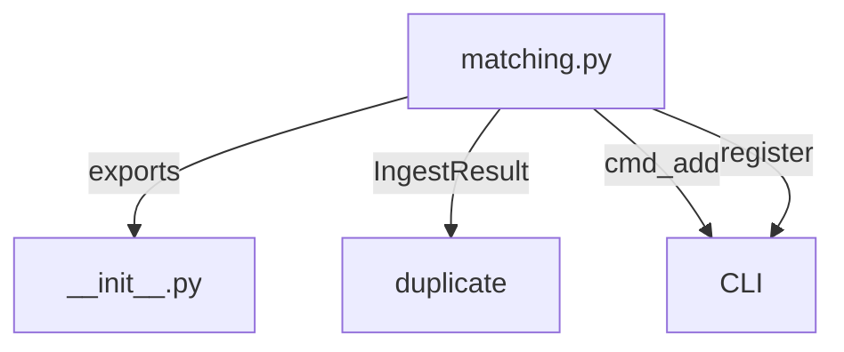
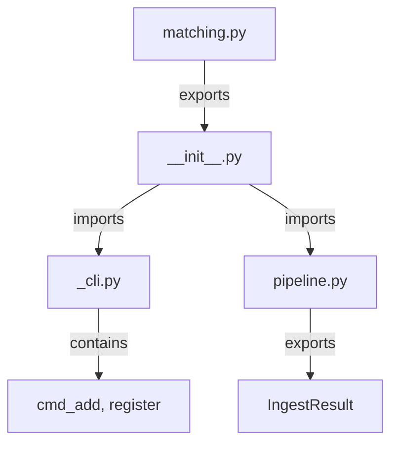

# Ingest Module Refactoring Implementation Plan

> Based on analysis of `plans/ingest-connection-plan.md`, `docs/AGENT.md`, and current codebase.
> Also includes loader.py context separation issues.

---

## 1. Issues Identified

### 1.1 Duplicate IngestResult

| Location | Status | Issue |
|----------|--------|-------|
| `matching.py:38-47` | DUPLICATE | Basic version without `md_path` |
| `pipeline.py:31-41` | KEEP | Complete version with `md_path` |

**Action**: Remove from `matching.py`, import from `pipeline.py` via `__init__.py`

### 1.2 CLI Commands Location

| Location | Should Be |
|----------|-----------|
| `matching.py:379-403` (register) | `__init__.py` |
| `matching.py:411-473` (cmd_add) | `__init__.py` |

**Action**: Move to `__init__.py`

### 1.3 Context Separation Violations

| File | Line | Issue | Fix |
|------|------|-------|-----|
| `matching.py` | 438 | Creates `RequestsClient()` internally | Accept as parameter |
| `matching.py` | 436 | Gets config from `ctx.config` | Accept as parameter |
| `loader.py` | 314 | Creates `RequestsClient()` internally | Accept as parameter |

### 1.4 AGENT.md Violations

| Location | Issue | Fix |
|----------|-------|-----|
| `matching.py:417-421` | `getattr(args, "doi", "")` pattern | Use direct attribute access with type hints |
| `matching.py:430-431` | Chinese UI messages | Convert to English |

### 1.5 Deep Nesting

| Function | Issue | Lines |
|----------|-------|-------|
| `score_candidate` | Nested if statements | 154-197 |

### 1.6 Loader.py Context Separation

| File | Line | Issue | Fix |
|------|------|-------|-----|
| `loader.py` | 314 | Creates `RequestsClient()` internally in `_get_runner` | Accept as parameter |
| `loader.py` | 313 | Gets api_key from `config.llm.resolve_api_key()` | Accept as parameter |

---

## 2. Implementation Plan

### Phase 1: Move CLI Commands to `__init__.py`

```python
# linkora/ingest/__init__.py (updated)

"""ingest — Paper ingestion pipeline.

Submodules:
- download: PDF download utilities
- pipeline: Functional data pipe for paper ingestion

Main exports:
- DefaultDispatcher: Source dispatcher for paper matching
- match_papers: Match papers from sources
- score_candidate: Score candidate against query
- parse_freeform_query: Parse free-form query strings
- cmd_add: CLI command handler (MOVED from matching.py)
- register: CLI argument registration (MOVED from matching.py)
- IngestResult: Result of paper ingestion
- ingest: Functional pipeline for processing candidates
"""

# Core matching (from matching.py)
from linkora.ingest.matching import (
    DefaultDispatcher,
    match_papers,
    score_candidate,
    parse_freeform_query,
    _parse_year_arg,
    _build_query,
)

# CLI commands (MOVED from matching.py)
from linkora.ingest._cli import (
    cmd_add,
    register,
)

# Pipeline
from linkora.ingest.pipeline import ingest, IngestResult

__all__ = [
    # Matching
    "DefaultDispatcher",
    "match_papers",
    "score_candidate",
    "parse_freeform_query",
    # CLI
    "cmd_add",
    "register",
    # Types
    "IngestResult",
    # Pipeline
    "ingest",
]
```

### Phase 2: Remove Duplicate IngestResult

Remove from `matching.py`:
```python
# REMOVE lines 37-47
@dataclass(frozen=True)
class IngestResult:
    """Result of paper ingestion."""
    ...
```

### Phase 3: Context Separation in matching.py

**Current (violates context separation)**:
```python
def cmd_add(args, ctx) -> None:
    config = ctx.config  # Gets from ctx internally
    local_pdf_dir = config.resolve_local_source_dir()
    http_client = RequestsClient() if config.openalex else None  # Creates internally
```

**After (context injected)**:
```python
def cmd_add(
    args,
    config,        # Injected
    http_client,   # Injected
) -> None:
    local_pdf_dir = config.resolve_local_source_dir()
    # Use injected http_client directly
```

### Phase 4: Fix AGENT.md Violations

**Replace getattr pattern**:
```python
# BEFORE (AGENT.md violation)
doi_val = getattr(args, "doi", "") or ""
issn_val = getattr(args, "issn", "") or ""

# AFTER (proper pattern)
doi_val: str = getattr(args, "doi", "") or ""
issn_val: str = getattr(args, "issn", "") or ""

# Even better - use dataclass for args
@dataclass
class AddCommandArgs:
    doi: str = ""
    issn: str = ""
    author: str = ""
    title: str = ""
    query: str = ""
    year: str | None = None
    source: str | None = None
    limit: int = 5
    cache: bool = False
    dry_run: bool = False
```

### Phase 5: Reduce Deep Nesting in score_candidate

**Before**:
```python
def score_candidate(candidate, query):
    score = 0.0
    if query.doi and candidate.doi:
        if query.doi.lower() == candidate.doi.lower():
            score += 1000
        elif query.doi.lower() in candidate.doi.lower():
            score += 100
    # ... more nested ifs
```

**After**:
```python
def score_candidate(candidate, query) -> float:
    """Score a candidate paper against query."""
    score = 0.0
    
    # DOI scoring
    score += _score_doi(query.doi, candidate.doi)
    
    # ISSN scoring  
    score += _score_issn(query.issn, candidate.journal)
    
    # Author scoring
    score += _score_author(query.author, candidate.authors)
    
    # Title scoring
    score += _score_title(query.title, candidate.title)
    
    # Year scoring
    score += _score_year(query.year_start, query.year_end, candidate.year)
    
    # PDF availability
    if candidate.pdf_url:
        score += 10
    
    return score


def _score_doi(query_doi: str | None, candidate_doi: str | None) -> float:
    """Score DOI match."""
    if not query_doi or not candidate_doi:
        return 0.0
    q = query_doi.lower()
    c = candidate_doi.lower()
    return 1000 if q == c else (100 if q in c else 0)
```

---

## 3. File Changes Summary

| File | Action | Lines |
|------|--------|-------|
| `linkora/ingest/__init__.py` | Add CLI imports, update docstring | +20 |
| `linkora/ingest/_cli.py` | CREATE - contains cmd_add, register | +100 |
| `linkora/ingest/matching.py` | Remove IngestResult, remove CLI functions | -80 |
| `linkora/ingest/pipeline.py` | No changes | 0 |
| `linkora/loader.py` | Fix context separation in `_get_runner` | Modified |

---

## 4. Mermaid: Current vs Target Architecture

### Current Architecture


### Target Architecture


---

## 5. Implementation Order

```
1. Create linkora/ingest/_cli.py with cmd_add, register
2. Update linkora/ingest/__init__.py imports
3. Remove IngestResult from matching.py
4. Remove CLI functions from matching.py
5. Fix context separation in _cli.py (inject config, http_client)
6. Fix AGENT.md violations (getattr pattern, Chinese messages)
7. Reduce nesting in score_candidate
8. Fix loader.py context separation (_get_runner accepts http_client)
9. Run ruff format and check
```

---

## 6. Verification

After implementation:
```bash
# Run format
uv run ruff format linkora/ingest/

# Run check
uv run ruff check linkora/ingest/

uv run ty check
```
