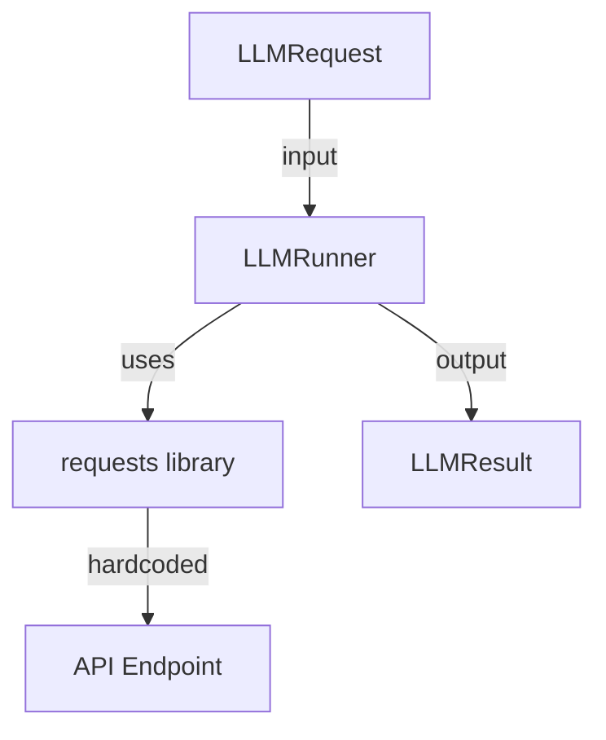
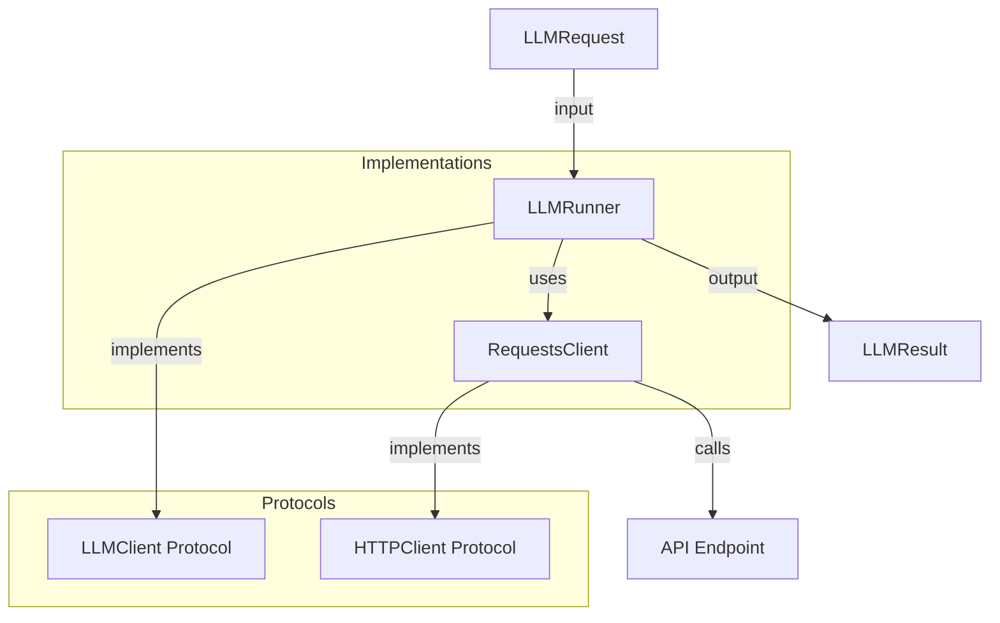

# llm.py Improvement Plan

## Current Issues Identified

### 1. Logging Pattern (Line 27)
**Issue**: Uses old logging pattern
```python
_log = logging.getLogger(__name__)
```
**Should be**: Using singleton pattern from `scholaraio.log`
```python
from scholaraio.log import get_logger
_log = get_logger(__name__)
```

### 2. Type Hints with Forward References (Line 40)
**Issue**: Uses string forward reference
```python
config: "Config | LLMConfig"
```
**Should be**: Direct import (per implementation-plan.md Section 2)
```python
from scholaraio.config import Config, LLMConfig
config: Config | LLMConfig
```

### 3. Missing Protocol Interface
**Issue**: No `LLMClient` Protocol defined (unlike `PDFClient` in mineru.py)
**Impact**: Not testable, cannot swap implementations easily

**Should add**:
```python
class LLMClient(Protocol):
    @property
    def name(self) -> str: ...
    def complete(self, request: LLMRequest) -> LLMResult: ...
```

### 4. API Key Resolution Inconsistency (Lines 85-93)
**Issue**: When `LLMConfig` is passed alone, it tries to use `config.api_key` but doesn't have the resolve method
```python
if isinstance(config, LLMConfig):
    self._llm_cfg = config
    self._api_key = api_key or config.api_key  # No fallback to env!
else:
    self._llm_cfg = config.llm
    self._api_key = api_key or config.resolve_llm_api_key()  # Has fallback
```

**Should be**: Consistent resolution - add `resolve_api_key()` method to `LLMConfig` or handle env resolution in LLMRunner

### 5. Embedded HTTP Client
**Issue**: `requests` library embedded directly in `_make_request` method
**Should be**: Inject HTTP client via Protocol (similar to PDFClient pattern)

### 6. Dataclass Field Mutability (Line 49)
**Issue**: `LLMResult` is not frozen, but it's a result object that should be immutable
```python
@dataclass  # Should be @dataclass(frozen=True)
class LLMResult:
```

---

## Improvement Plan

### Phase 1: Fix Logging and Type Imports
- [ ] Replace `logging.getLogger(__name__)` with `get_logger(__name__)`
- [ ] Change string forward reference to direct imports

### Phase 2: Add Protocol Interface
- [ ] Create `LLMClient` Protocol
- [ ] Create `HTTPClient` Protocol for request abstraction
- [ ] Refactor `LLMRunner` to use injected client

### Phase 3: Fix API Key Resolution
- [ ] Add `resolve_api_key()` method to `LLMConfig` in config.py
- [ ] Update `LLMRunner` to use consistent resolution

### Phase 4: Immutable Results
- [ ] Make `LLMResult` frozen dataclass

---

## Mermaid: Current vs Improved Architecture

### Current Architecture


### Improved Architecture


---

## Priority Order

| Priority | Task | Reason |
|----------|------|--------|
| P0 | Fix logging pattern | Code consistency |
| P0 | Fix API key resolution | Security/functionality |
| P1 | Add Protocol interface | Testability, interface-based design |
| P2 | Make LLMResult frozen | Immutability principle |
| P3 | Extract HTTP client | Follows mineru.py pattern |
