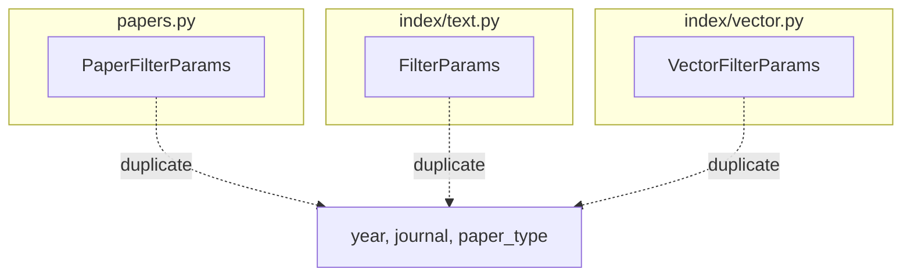

# Papers.py & Audit Improvement Plan (Enhanced)

> Based on analysis of `linkora/papers.py`, `linkora/cli/commands.py`, `linkora/index/text.py`, `linkora/index/vector.py` and `docs/AGENT.md` philosophy.

---

## 1. Issues Identified

### 1.1 Redundant Filter Data Structures (CRITICAL)

**Problem**: Three separate filter classes with identical fields:

| Class | Location | Purpose | Extra Methods |
|-------|----------|---------|---------------|
| `PaperFilterParams` | papers.py | In-memory filtering | `.matches()` |
| `FilterParams` | index/text.py | SQL queries | `.to_sql()` |
| `VectorFilterParams` | index/vector.py | Vector search | None |

**All have**: `year`, `journal`, `paper_type` - DUPLICATE!

### 1.2 Deep Nesting in PaperFilterParams.matches() (CRITICAL)

Current code (lines 138-192 in papers.py):
```python
def matches(self, meta: dict) -> bool:
    if self.year:
        if self.year.startswith(">"):
            min_year = int(self.year[1:])
            py = meta.get("year")
            if not isinstance(py, int) or py <= min_year:
                return False
        elif self.year.startswith("<"):
            # ... more nesting
        # 4 levels deep!
    # ... more nested conditions
```
**Solution**: Flatten with early returns and helper functions

### 1.3 AGENT.md Violations - getattr Pattern (CRITICAL)

| Location | Current | Should Be |
|----------|---------|-----------|
| commands.py:98-166 | `getattr(args, "x", default)` | Direct `args.x` with type hints |

### 1.4 Redundant Code in CLI

**Problem**: Same filter arguments defined 3 times:
- `search` command (lines 471-483)
- `top-cited` command (lines 489-501)
- `add` command (line 515)

**Problem**: Same filters dict created multiple times:
```python
filters = {
    "year": getattr(args, "year", None),
    "journal": getattr(args, "journal", None),
    "paper_type": getattr(args, "paper_type", None),
}
```

### 1.5 Unused format_audit Function

**Problem**: `format_audit()` exists in papers.py but CLI manually formats output (lines 224-230 in commands.py)

### 1.6 Audit Efficiency

**Problem**: Severity filter applied AFTER audit runs (filtering in Python)

---

## 2. Implementation Plan

### Phase 1: Create Unified Filter (filters.py)

Since there's no existing `filters.py`, create it:

```python
# linkora/filters.py (NEW - or extend existing)

from dataclasses import dataclass
from typing import Protocol

@dataclass(frozen=True)
class QueryFilter:
    """Unified filter parameters for all operations.
    
    Fields:
        year: Year filter (">2020", "<2024", "2020-2024", "2024")
        journal: Journal name (partial match)
        paper_type: Paper type (partial match)
    """
    year: str | None = None
    journal: str | None = None
    paper_type: str | None = None
    
    def matches(self, meta: dict) -> bool:
        """In-memory filter - flattened implementation."""
        # Year check
        if self.year:
            py = meta.get("year")
            if not isinstance(py, int):
                return False
            if not _year_matches(py, self.year):
                return False
        
        # Journal check  
        if self.journal:
            j = meta.get("journal")
            if not j or not isinstance(j, str):
                return False
            if self.journal.lower() not in j.lower():
                return False
        
        # Paper type check
        if self.paper_type:
            pt = meta.get("paper_type")
            if not pt or not isinstance(pt, str):
                return False
            if self.paper_type.lower() != pt.lower():
                return False
        
        return True


def _year_matches(year: int, filter_str: str) -> bool:
    """Flattened year matching - early returns, no nesting."""
    # Exact year
    if not filter_str.startswith((">", "<")) and "-" not in filter_str:
        return year == int(filter_str)
    
    # Greater than
    if filter_str.startswith(">"):
        return year > int(filter_str[1:])
    
    # Less than
    if filter_str.startswith("<"):
        return year < int(filter_str[1:])
    
    # Range
    if "-" in filter_str:
        parts = filter_str.split("-")
        if len(parts) == 2:
            start = int(parts[0]) if parts[0] else None
            end = int(parts[1]) if parts[1] else None
            if start and year < start:
                return False
            if end and year > end:
                return False
            return True
    
    return True  # Fallback
```

### Phase 2: Update FilterParams (index/text.py)

Make it extend or use QueryFilter:

```python
# linkora/index/text.py

from linkora.filters import QueryFilter

@dataclass(frozen=True)
class FilterParams(QueryFilter):
    """Filter parameters for FTS search.
    
    Inherits: year, journal, paper_type
    Adds: to_sql() for database queries
    """
    
    def to_sql(self) -> tuple[str, list[str]]:
        """Convert to SQL WHERE clause."""
        clauses, params = [], []
        
        if self.year:
            start, end = parse_year_range(self.year)
            # ... simplified
        if self.journal:
            clauses.append("journal LIKE ?")
            params.append(f"%{self.journal}%")
        if self.paper_type:
            clauses.append("paper_type LIKE ?")
            params.append(f"%{self.paper_type}%")
        
        return (" AND ".join(clauses), params) if clauses else ("", [])
```

### Phase 3: Update VectorFilterParams

```python
# linkora/index/vector.py

from linkora.filters import QueryFilter

@dataclass(frozen=True)
class VectorFilterParams(QueryFilter):
    """Filter parameters for vector search.
    
    Inherits all fields and matches() from QueryFilter.
    """
    pass  # No extra methods needed
```

### Phase 4: Update PaperFilterParams

```python
# linkora/papers.py - Remove duplicate, import unified filter

from linkora.filters import QueryFilter

# Remove PaperFilterParams entirely, use QueryFilter
# OR keep alias for backward compatibility
PaperFilterParams = QueryFilter
```

### Phase 5: Fix AGENT.md Violations in CLI

Replace all `getattr(args, "x", default)` with direct attribute access:

```python
# BEFORE (violates AGENT.md)
def cmd_search(args: argparse.Namespace, ctx: AppContext) -> None:
    query = " ".join(args.query) if hasattr(args, "query") and args.query else ""
    filters = {
        "year": getattr(args, "year", None),
        "journal": getattr(args, "journal", None),
        "paper_type": getattr(args, "paper_type", None),
    }

# AFTER (AGENT.md compliant)
def cmd_search(args: argparse.Namespace, ctx: AppContext) -> None:
    query: str = " ".join(args.query) if args.query else ""
    filters = QueryFilter(
        year=args.year,
        journal=args.journal,
        paper_type=args.paper_type,
    )
```

### Phase 6: Use Shared Filter Argument Builder

Create helper to avoid repeated argument definitions:

```python
def add_filter_args(parser) -> None:
    """Add shared filter arguments to parser."""
    parser.add_argument("--year", type=str, help="Year filter: 2023 / 2020-2024 / >2020")
    parser.add_argument("--journal", type=str, help="Journal name filter")
    parser.add_argument("--type", type=str, dest="paper_type", help="Paper type filter")


def build_filter(args: argparse.Namespace) -> QueryFilter:
    """Build QueryFilter from args."""
    return QueryFilter(
        year=args.year,
        journal=args.journal,
        paper_type=args.paper_type,
    )
```

### Phase 7: Improve Audit Efficiency

Add severity filter to audit() method:

```python
# linkora/papers.py

def audit(
    self,
    *,
    rules: list[Callable[[Path, dict], list[Issue]]] | None = None,
    severity: set[str] | None = None,  # NEW: filter during audit
) -> list[Issue]:
    """Run audit with optional severity filter."""
    rules = rules or DEFAULT_RULES
    issues: list[Issue] = []
    
    # Early exit
    if severity is not None and not severity:
        return []
    
    collect_all = severity is None
    
    for pdir in self.iter_papers():
        # ... existing logic ...
        
        for rule in rules:
            rule_issues = rule(pdir, data)
            if collect_all:
                issues.extend(rule_issues)
            else:
                # Filter during collection
                issues.extend(i for i in rule_issues if i.severity in severity)
    
    # ... rest unchanged
```

### Phase 8: Use format_audit in CLI

```python
# linkora/cli/commands.py

from linkora.papers import format_audit

def cmd_audit(args: argparse.Namespace, ctx: AppContext) -> None:
    """Audit paper data quality."""
    severity = None
    if args.severity:
        severity = set(s.strip() for s in args.severity.split(","))
    
    store = ctx.paper_store()
    issues = store.audit(severity=severity)
    
    if not issues:
        ui("No issues found.")
        return
    
    # Use existing function instead of manual formatting
    report = format_audit(issues)
    ui(f"Found {len(issues)} issues:\n{report}")
```

---

## 3. Files to Modify

| File | Changes |
|------|---------|
| `linkora/filters.py` | CREATE: Unified QueryFilter class |
| `linkora/papers.py` | Import QueryFilter, update audit(), remove PaperFilterParams |
| `linkora/index/text.py` | Make FilterParams extend QueryFilter |
| `linkora/index/vector.py` | Make VectorFilterParams extend QueryFilter |
| `linkora/cli/commands.py` | Fix getattr, use QueryFilter, use format_audit |

---

## 4. Lines of Code Reduction

| Before | After | Reduction |
|--------|-------|-----------|
| 3 filter classes × ~15 lines each | 1 QueryFilter (~30 lines) | -15 lines |
| Deep nesting in matches() | Flattened (~20 lines) | -30 lines |
| Repeated filter args in CLI (~30 lines) | Shared helper (~10 lines) | -20 lines |
| Manual format in CLI (~10 lines) | format_audit() call | -10 lines |

**Total estimated reduction**: ~75 lines

---

## 5. Mermaid: Current vs Target Architecture

### Current (Redundant)


### Target (Unified)
```mermaid
graph TD
    subgraph filters.py
        D[QueryFilter]
    end
    papers.py -->|import| D
    index/text.py -->|extend| D
    index/vector.py -->|extend| D
    
    D -->|has| E[year, journal, paper_type]
    D -->|has| F[matches()]
    D -->|has| G[to_sql()]
```

---

## 6. Backward Compatibility

- `PaperFilterParams` kept as alias: `PaperFilterParams = QueryFilter`
- All existing code using filter fields still works
- CLI arguments unchanged (just the implementation improved)
