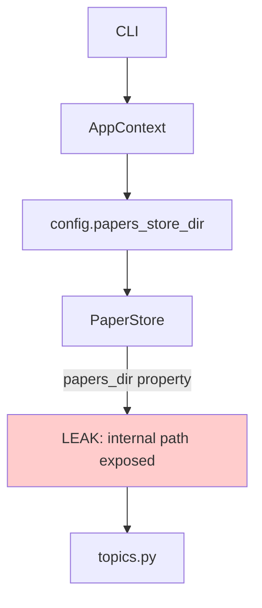

# Papers Module Refactoring Plan

> Design for merging audit.py into papers.py, removing exposed papers_dir leak, and improving data flow with PaperFilterParams.

---

## 1. Current State Analysis

### 1.1 Already Completed

| Item | Status | Location |
|------|--------|----------|
| Audit imports | ✅ Done | `papers.py:17` imports Issue, YearRange, DEFAULT_RULES |
| PaperFilterParams | ✅ Done | `papers.py:93-156` |
| select() method | ✅ Done | `papers.py:244-256` |
| select_meta() method | ✅ Done | `papers.py:258-261` |
| audit() method | ✅ Done | `papers.py:371-413` |

### 1.2 Issues to Fix

| Issue | Location | Problem |
|-------|----------|---------|
| Exposed papers_dir | `PaperStore.papers_dir` (line 181-184) | Public API leaks internal path |
| Direct path access | `topics.py:508` | Uses `store.papers_dir` directly |
| Path helpers | `papers.py:356-367` | Legacy methods: paper_dir(), meta_path(), md_path() |

---

## 2. Design: Remove papers_dir Leak

### 2.1 Current Design (Problematic)

```python
class PaperStore:
    _papers_dir: Path  # Private
    
    @property
    def papers_dir(self) -> Path:  # LEAKED!
        return self._papers_dir
```

### 2.2 Target Design (Safe)

```python
class PaperStore:
    _papers_dir: Path  # Private, no property
    
    def get_paper_dir(self, dir_name: str) -> Path:
        """Internal: get paper directory path."""
        return self._papers_dir / dir_name
    
    def paper_dir(self, dir_name: str) -> Path:
        """Legacy: get paper directory path."""
        return self.get_paper_dir(dir_name)
```

---

## 3. Data Flow with PaperFilterParams

### 3.1 Current Flow

```python
# In topics.py (PROBLEMATIC)
paper_d = store.papers_dir / dir_name  # Direct path access!
meta = store.read_meta(paper_d)
```

### 3.2 Target Flow (Data Pipe)

```python
# Using PaperFilterParams - clean data flow
for meta in store.select_meta(PaperFilterParams()):
    # Process each paper's metadata
    title = meta.get("title")
    abstract = meta.get("abstract")
```

### 3.3 Available Methods

| Method | Purpose | Returns |
|--------|---------|---------|
| `iter_papers()` | Iterate paper directories | Iterator[Path] |
| `select(filter)` | Select with filter | Iterator[tuple[Path, dict]] |
| `select_meta(filter)` | Select metadata only | Iterator[dict] |
| `read_meta(paper_d)` | Read single meta.json | dict |
| `read_md(paper_d)` | Read single paper.md | str \| None |

---

## 4. Implementation Plan

### Phase 1: Remove papers_dir Property

1. Remove `papers_dir` property from `PaperStore`
2. Keep `_papers_dir` as private field
3. Add `get_paper_dir(dir_name)` method

```python
# papers.py - Remove this:
@property
def papers_dir(self) -> Path:
    """Get papers directory (read-only)."""
    return self._papers_dir

# Add instead:
def get_paper_dir(self, dir_name: str) -> Path:
    """Get paper directory path by dir_name."""
    return self._papers_dir / dir_name
```

### Phase 2: Fix topics.py

Current (line 508):
```python
paper_d = store.papers_dir / dir_name
```

Target:
```python
paper_d = store.get_paper_dir(dir_name)
```

### Phase 3: Clean Up Legacy Path Helpers

The current path helpers can be simplified:

```python
# Current (papers.py lines 356-367)
def paper_dir(self, dir_name: str) -> Path:
    return self._papers_dir / dir_name

def meta_path(self, dir_name: str) -> Path:
    return self._papers_dir / dir_name / "meta.json"

def md_path(self, dir_name: str) -> Path:
    return self._papers_dir / dir_name / "paper.md"
```

These can be refactored to use the internal method or removed if not used externally.

### Phase 4: Verify Commands Use PaperStore Properly

Check `commands.py`:
- `cmd_audit` uses `store.audit()` - ✅ OK
- `cmd_enrich` uses `store.iter_papers()` - ✅ OK
- Index commands use store passed to index modules - ✅ OK

---

## 5. File Changes Summary

| File | Changes |
|------|---------|
| `linkora/papers.py` | Remove papers_dir property, add get_paper_dir() |
| `linkora/topics.py` | Change store.papers_dir to store.get_paper_dir() |

---

## 7. Mermaid: Current vs Target Architecture

### Current (Leaking papers_dir)


### Target (Clean Data Flow)
```mermaid
graph TD
    A[CLI] --> B[AppContext]
    B --> C[PaperStore]
    C -->|select_meta filter| D[Iterator[dict]]
    C -->|get_paper_dir| E[Internal path resolution]
    
    D --> F[Process metadata]
    E --> G[topics.py internal]
    
    style D fill:#ccffcc
    style E fill:#ccffcc
```

---

## 8. Summary

| Task | Status |
|------|--------|
| Merge audit.py into papers.py | ✅ Done (already imported) |
| Remove papers_dir property | ⬜ Need implementation |
| Add get_paper_dir() method | ⬜ Need implementation |
| Fix topics.py | ⬜ Need implementation |
| Verify CLI commands | ⬜ Need verification |
