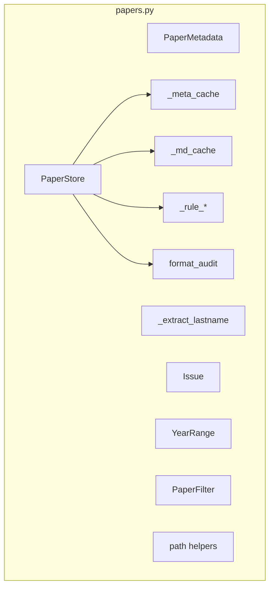
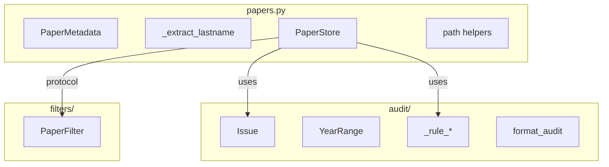

# papers.py Refactoring Plan

> Refactor `scholaraio/papers.py` into aligned architecture with `extract.py` and `loader.py`.
> Based on `loader-redesign-plan.md` philosophy and `docs/AGENT.md` coding standards.

---

## 1. Issues Identified

### 1.1 Logging Pattern (Critical)

| Location | Current | Should Be |
|----------|---------|-----------|
| Line 18 | `_log = logging.getLogger(__name__)` | `from scholaraio.log import get_logger` |

**Reference**: `extract.py` line 47 uses correct pattern.

---

### 1.2 Multiple Responsibilities (High)

Current `papers.py` contains **7 distinct responsibilities**:

| # | Component | Responsibility | Should Be |
|---|-----------|---------------|-----------|
| 1 | `PaperMetadata` | Data model | Keep in papers.py |
| 2 | `_extract_lastname()` | Pure function | Keep (used by extract.py) |
| 3 | `Issue` | Audit data model | Move to audit module |
| 4 | `YearRange` | Filter utility | Move to filters module |
| 5 | `PaperStore` | Storage + caching + audit | Split into separate concerns |
| 6 | `_rule_*` functions | Audit rules | Move to audit module |
| 7 | `format_audit()` | Report formatting | Move to audit module |
| 8 | Path helpers | File path utilities | Keep (simple helpers) |
| 9 | `PaperFilter` | Filter with matching | Move to filters module |

---

### 1.3 State Leak Risk (Critical)

| Component | Danger | Risk Level |
|-----------|--------|------------|
| `PaperStore._meta_cache` | Mutable dict - stale data | **HIGH** |
| `PaperStore._md_cache` | Mutable dict - stale data | **HIGH** |

**Problem**: Mutable caches persist state across calls, causing stale data issues.

**Reference**: `loader-redesign-plan.md` Section 3 identifies same issue.

---

### 1.4 No Protocol Pattern

| Current | Should Be |
|---------|-----------|
| `PaperFilter` is a dataclass with `matches()` method | Use Protocol pattern for filter matching |

**Reference**: `extract.py` uses Protocol for `Extractor`.

---

### 1.5 Type Imports

| Location | Current | Should Be |
|----------|---------|-----------|
| Line 16 | `from typing import Iterator, Callable` | Add `TYPE_CHECKING` guard or direct import |

**Note**: Current code doesn't use TYPE_CHECKING, so direct import is fine.

---

## 2. Architecture Alignment

### 2.1 Relationship with extract.py

| Component | papers.py | extract.py | Action |
|-----------|-----------|------------|--------|
| `PaperMetadata` | ✅ Source | ✅ Reuses | Keep in papers.py |
| `_extract_lastname` | ✅ Source | ✅ Reuses | Keep in papers.py |
| Frozen dataclasses | ❌ Not used | ✅ Uses | Adopt in papers.py |
| Protocol pattern | ❌ Not used | ✅ Uses | Adopt for filters |
| Data pipe flow | ❌ Not used | ✅ Uses | Adopt in PaperStore |

### 2.2 Relationship with loader.py

| Component | papers.py | loader.py | Action |
|-----------|-----------|-----------|--------|
| `PaperStore` | ✅ Source | ✅ Uses | Align patterns |
| Immutable types | ❌ Not used | ✅ Uses | Adopt |
| Stage-based pipeline | ❌ Not used | ✅ Uses | Consider for audit |

---

## 3. Refactoring Plan

### Phase 1: Fix Logging (P0)

```python
# OLD (line 18):
import logging
_log = logging.getLogger(__name__)

# NEW:
from scholaraio.log import get_logger
_log = get_logger(__name__)
```

---

### Phase 2: Create audit/ Module (P1)

New directory structure:

```
scholaraio/
├── papers.py              # Keep: PaperMetadata, _extract_lastname, path helpers
├── audit/
│   ├── __init__.py       # Exports: Issue, YearRange, PaperFilter, AuditRunner
│   ├── types.py          # Issue, YearRange, PaperFilter
│   ├── rules.py          # _rule_* functions
│   └── formatter.py      # format_audit()
```

#### 3.2.1 New audit/types.py

```python
"""Audit data types - immutable."""

from dataclasses import dataclass


@dataclass(frozen=True)
class Issue:
    """Audit issue report - immutable."""
    paper_id: str
    severity: str  # "error" | "warning" | "info"
    rule: str
    message: str


class YearRange(tuple):
    """Year filter range: (start, end) with None for unbounded."""
    __slots__ = ()

    def __new__(cls, start: int | None, end: int | None) -> "YearRange":
        return super().__new__(cls, (start, end))

    @property
    def start(self) -> int | None:
        return self[0]

    @property
    def end(self) -> int | None:
        return self[1]
```

#### 3.2.2 New audit/rules.py

```python
"""Audit rules - pure functions."""

from pathlib import Path
from typing import Protocol

from scholaraio.audit.types import Issue


class PaperReader(Protocol):
    """Protocol for reading paper data."""
    def read_meta(self, paper_d: Path) -> dict: ...
    def read_md(self, paper_d: Path) -> str | None: ...


def rule_missing_fields(reader: PaperReader, pdir: Path, data: dict) -> list[Issue]:
    """Check missing required fields."""
    # ... implementation


def rule_file_pairing(reader: PaperReader, pdir: Path, data: dict) -> list[Issue]:
    """Check meta.json / paper.md pairing."""
    # ... implementation


def rule_title_match(reader: PaperReader, pdir: Path, data: dict) -> list[Issue]:
    """Check JSON title vs MD H1 consistency."""
    # ... implementation


def rule_filename_format(reader: PaperReader, pdir: Path, data: dict) -> list[Issue]:
    """Check directory name format."""
    # ... implementation


DEFAULT_RULES: list[callable] = [
    rule_missing_fields,
    rule_file_pairing,
    rule_title_match,
    rule_filename_format,
]
```

#### 3.2.3 New audit/formatter.py

```python
"""Audit report formatter."""

from scholaraio.audit.types import Issue


def format_audit(issues: list[Issue]) -> str:
    """Format audit issues as report."""
    # ... implementation
```

---

### Phase 3: Create filters/ Module (P2)

#### 3.3.1 New filters/types.py

```python
"""Paper filter types - Protocol-based matching."""

from dataclasses import dataclass
from typing import Protocol

from scholaraio.audit.types import YearRange


class PaperFilter(Protocol):
    """Protocol for paper filters."""
    def matches(self, meta: dict) -> bool: ...


@dataclass(frozen=True)
class PaperFilterParams:
    """Immutable filter parameters."""
    year: str | None = None
    journal: str | None = None
    paper_type: str | None = None
    author: str | None = None

    def matches(self, meta: dict) -> bool:
        """Check if paper metadata matches filter."""
        # ... implementation (moved from current PaperFilter)
```

---

### Phase 4: Refactor PaperStore (P3)

#### 3.4.1 State Leak Mitigation

Current problematic design:
```python
class PaperStore:
    _meta_cache: dict[Path, dict]  # MUTABLE - state leak risk
    _md_cache: dict[Path, str]    # MUTABLE - state leak risk
```

New design options:

**Option A: Context-based (Recommended)**
```python
@dataclass(frozen=True)
class StoreContext:
    """Immutable context for store operations."""
    papers_dir: Path
    cache: dict[Path, dict] = field(default_factory=dict)


class PaperStore:
    """Paper storage with optional caching."""
    
    papers_dir: Path
    _enable_cache: bool = True
    
    def with_context(self) -> StoreContext:
        """Create context for this session."""
        return StoreContext(papers_dir=self.papers_dir)
    
    def read_meta(self, paper_d: Path, context: StoreContext | None = None) -> dict:
        """Read meta.json with optional context."""
        # If context provided, use its cache; otherwise direct read
```

**Option B: Immutable by default**
```python
class PaperStore:
    """Immutable paper storage - no internal caching."""
    
    papers_dir: Path
    
    def read_meta(self, paper_d: Path) -> dict:
        """Read meta.json - no caching."""
        p = paper_d / "meta.json"
        return json.loads(p.read_text(encoding="utf-8"))
```

#### 3.4.2 Pipeline-based Audit

Current:
```python
def audit(self, rules: list | None = None) -> list[Issue]:
    """Run audit on all papers."""
    # Mixed concerns: iteration + rule execution + duplicate detection
```

New (aligned with extract.py pipe flow):
```python
def audit(
    self,
    rules: list[callable] | None = None,
) -> list[Issue]:
    """Run audit pipeline."""
    # Stage 1: Collect all paper data
    papers = list(self.iter_papers())
    paper_data = self._load_all_papers(papers)
    
    # Stage 2: Run rules
    issues = self._run_rules(paper_data, rules or DEFAULT_RULES)
    
    # Stage 3: Cross-paper checks (DOI duplicates)
    issues.extend(self._check_duplicates(paper_data))
    
    return issues
```

---

### Phase 5: Update Imports (P4)

After restructuring:

```python
# papers.py - simplified
from scholaraio.log import get_logger
from scholaraio.audit.types import Issue, YearRange
from scholaraio.audit.rules import DEFAULT_RULES

_log = get_logger(__name__)

# Keep: PaperMetadata, _extract_lastname, PaperStore, path helpers
```

---

## 4. Implementation Order

```
1. Fix logging in papers.py (P0)
2. Fix logging in loader.py (P0)
3. Remove duplicate PromptTemplate from loader.py, import from llm.py (P1)
4. Refactor loader.py to use llm.py LLMRunner directly (P2)
5. Create scholaraio/audit/ directory
6. Create audit/types.py (Issue, YearRange)
7. Create audit/rules.py (_rule_* functions)
8. Create audit/formatter.py (format_audit)
9. Create audit/__init__.py
10. Create filters/ module
11. Refactor PaperStore (state leak mitigation)
12. Update all imports across codebase
13. Test that audit command still works
```

---

## 5. Files Affected

| File | Action |
|------|--------|
| `scholaraio/papers.py` | Fix logging, keep core types |
| `scholaraio/loader.py` | Fix logging, remove duplicate PromptTemplate, use llm.py directly |
| `scholaraio/audit/__init__.py` | CREATE |
| `scholaraio/audit/types.py` | CREATE |
| `scholaraio/audit/rules.py` | CREATE |
| `scholaraio/audit/formatter.py` | CREATE |
| `scholaraio/filters/__init__.py` | CREATE |
| `scholaraio/filters/types.py` | CREATE |
| `scholaraio/extract.py` | Already correct |
| CLI commands | Update imports |

---

## 6. Mermaid: Current vs Target Architecture

### Current Architecture


### Target Architecture


---

## 7. Dependencies

- `scholaraio/log.py` - Logger singleton
- `scholaraio/config.py` - Configuration (for paths)
- No new external dependencies

---

## 8. Backward Compatibility

| Export | Current Location | New Location | Alias |
|--------|-----------------|--------------|-------|
| `Issue` | papers.py | audit/types.py | ✅ |
| `YearRange` | papers.py | audit/types.py | ✅ |
| `PaperFilter` | papers.py | filters/types.py | ✅ |
| `format_audit` | papers.py | audit/formatter.py | ✅ |
| `_rule_*` | papers.py | audit/rules.py | Internal only |

**Strategy**: Keep re-exports in papers.py for backward compatibility during transition.

```python
# papers.py - backward compatibility exports
from scholaraio.audit.types import Issue as Issue, YearRange as YearRange
from scholaraio.audit.formatter import format_audit
from scholaraio.filters.types import PaperFilter as PaperFilter
```

---

## 9. Cross-Module Analysis: Duplicates and Wheel Recreation

### 9.1 Duplicate PromptTemplate

| Location | Status | Should Be |
|----------|--------|----------|
| `scholaraio/llm.py` line 123 | ✅ ORIGINAL | Keep |
| `scholaraio/loader.py` line 43-51 | ❌ DUPLICATE | Import from llm.py |
| `scholaraio/extract.py` | ✅ Correct | Uses llm.py |

**Fix**: Remove duplicate in loader.py, import from llm.py

```python
# loader.py - REMOVE this:
@dataclass(frozen=True)
class PromptTemplate:
    """Immutable prompt template."""
    system: str
    user_template: str
    
    def render(self, **kwargs: str) -> str:
        return self.user_template.format(**kwargs)

# loader.py - ADD this import:
from scholaraio.llm import PromptTemplate
```

---

### 9.2 Wrapper Classes Adding No Value

| Wrapper Class | Wraps | Issue |
|---------------|-------|-------|
| `loader.py LLMRunner` (line 312) | `scholaraio.llm.LLMRunner` | Thin wrapper, adds no value |
| `loader.py ContentExtractor` (line 223) | Module-level functions | Should be pure functions |
| `loader.py StrategyRegistry` (line 124) | Dictionary dispatch | Can be module-level dict |

**Pylance Errors Confirm Issues:**
```
loader.py:337 - Argument of type "Config" cannot be assigned to parameter "config" of type "LLMConfig"
loader.py:367 - No parameter named "http_client"
loader.py:411 - Cannot access attribute "paper_dir" for class "PaperStore"
```

**Analysis**: 
- `loader.py LLMRunner` wraps `llm.LLMRunner` but changes the API incorrectly
- `loader.py` should directly use `llm.LLMRunner` like `extract.py` does
- The `paper_dir` method doesn't exist on PaperStore - loader.py is broken!

---

### 9.3 papers.py: Redundant Class + Standalone Functions

| Class Method | Standalone Function | Issue |
|--------------|---------------------|-------|
| `PaperStore.read_meta()` | `read_meta()` | Both exist! |
| `PaperStore.iter_papers()` | `iter_paper_dirs()` | Both exist! |
| N/A | `paper_dir()` | Used incorrectly by loader.py! |

**Current state**:
- `PaperStore.read_meta()` - cached, uses instance cache
- `read_meta(paper_d)` - uncached, direct read
- `PaperStore.iter_papers()` - yields Path objects
- `iter_paper_dirs(papers_dir)` - yields Path objects
- `paper_dir(papers_dir, dir_name)` - standalone function

**loader.py bug**: Uses `self._store.paper_dir(paper_id)` but PaperStore has no `paper_dir` method!
- Should be: `paper_dir(self._store.papers_dir, paper_id)`

**Recommendation**: Keep standalone functions (simpler, no state), remove class methods or make them thin wrappers.

---

### 9.4 loader.py: Old Logging (Still Not Fixed)

| Location | Current | Should Be |
|----------|---------|----------|
| `loader.py` line 36 | `_log = logging.getLogger(__name__)` | `from scholaraio.log import get_logger` |

This is mentioned in loader-redesign-plan.md but NOT YET FIXED.

---

### 9.5 config.py Path Properties vs papers.py Path Helpers

| config.py | papers.py | Issue |
|-----------|-----------|-------|
| `Config.papers_dir` property | `paper_dir(papers_dir, dir_name)` | Overlap |
| `Config.workspace_dir` | `meta_path()`, `md_path()` | Overlap |

**Analysis**: `config.py` has properties for paths, `papers.py` has helper functions. These should work together:
- `config.papers_dir` → base papers directory
- `papers.paper_dir(config.papers_dir, paper_id)` → specific paper directory

This is correct - config provides base paths, papers.py provides helpers. NO CHANGE NEEDED.

---

## 10. Summary: Wheel Recreation Found

| Issue | Files | Action |
|-------|-------|--------|
| Duplicate PromptTemplate | loader.py | Remove, import from llm.py |
| Wrapper LLMRunner | loader.py | Remove, use llm.py directly |
| Class methods = standalone funcs | papers.py | Consolidate to one pattern |
| Old logging | loader.py | Fix (P0) |

---

## Summary

| Priority | Issue | Fix |
|----------|-------|-----|
| P0 | Old logging (papers.py) | Use `get_logger` |
| P0 | Old logging (loader.py) | Use `get_logger` |
| P1 | Duplicate PromptTemplate | Import from llm.py |
| P1 | Multiple responsibilities | Split into papers/, audit/, filters/ |
| P2 | State leak in PaperStore | Context-based or immutable design |
| P2 | Wrapper classes in loader.py | Use llm.py directly |
| P3 | No Protocol pattern | Add Protocol for filters |

