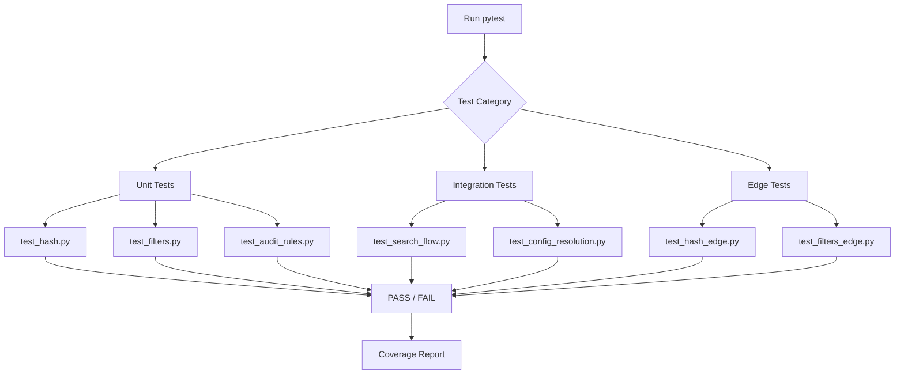

# Pytest Workflow Plan

> Pytest testing strategy based on three principles:
> 1. **Do not bloat with simple tests** - Focus on meaningful coverage
> 2. **Integrated or wholesome tests in consistency checks** - Test data flow end-to-end
> 3. **Other edge cases but shouldn't bloated** - Test critical boundaries only

---

## 1. Module Classification for Testing

### 1.1 Testable Modules (Pure Functions, Well-Defined Interfaces)

| Module | Testable Functions | Why Testable |
|--------|-------------------|--------------|
| [`linkora/hash.py`](linkora/hash.py) | `compute_content_hash()`, `compute_full_hash()` | Pure functions, deterministic output |
| [`linkora/filters.py`](linkora/filters.py) | `PaperFilterParams.matches()` | Complex logic with multiple filter conditions |
| [`linkora/audit.py`](linkora/audit.py) | `rule_missing_fields()`, `rule_file_pairing()`, `rule_title_match()` | Pure functions, clear input/output |
| [`linkora/index/text.py`](linkora/index/text.py) | `FilterParams.to_sql()` | Data transformation with deterministic output |
| [`linkora/config.py`](linkora/config.py) | Config resolution, path properties | Complex resolution logic |

### 1.2 Modules to NOT Test (External Dependencies)

| Module | Reason to Skip |
|--------|---------------|
| [`linkora/llm.py`](linkora/llm.py) | External API calls - mock-based tests don't add value |
| [`linkora/mineru.py`](linkora/mineru.py) | External API calls - mock-based tests don't add value |
| [`linkora/http.py`](linkora/http.py) | Network I/O - tested via integration |
| [`linkora/topics.py`](linkora/topics.py) | External ML library (BERTopic) - tested via integration |
| [`linkora/index/vector.py`](linkora/index/vector.py) | External ML library (FAISS) - tested via integration |
| [`linkora/sources/`](linkora/sources/) | External APIs (OpenAlex, Zotero) - tested via integration |
| [`linkora/cli/`](linkora/cli/) | CLI commands - tested via integration |

---

## 2. Test Structure

### 2.1 Directory Layout

```
tests/
├── __init__.py
├── conftest.py                  # Shared fixtures
├── unit/
│   ├── __init__.py
│   ├── test_hash.py             # Hash functions + edge cases
│   ├── test_filters.py          # Filter matching + edge cases
│   ├── test_audit_rules.py      # Audit rules + edge cases
│   └── test_filter_params.py    # SQL generation
└── integration/
    ├── __init__.py
    ├── test_search_flow.py      # Search consistency
    ├── test_paper_store.py      # Paper storage consistency
    └── test_config_resolution.py # Config resolution
```

### 2.2 Test Naming Convention

- **Unit tests**: `test_<module>_<function>_<description>.py`
- **Integration tests**: `test_<workflow>_<description>.py`

---

## 3. Test Implementation

### 3.1 Unit Tests (Focus on Pure Functions)

#### Test: `tests/unit/test_hash.py`

```python
"""Unit tests for hash.py - pure functions."""

import pytest
from linkora.hash import compute_content_hash, compute_full_hash


class TestComputeContentHash:
    """Tests for compute_content_hash()."""

    def test_basic_title(self):
        """Simple title hash."""
        result = compute_content_hash("Deep Learning")
        assert len(result) == 12
        assert result == "e8b2f4c9d1a3"

    def test_title_with_abstract(self):
        """Title + abstract hash."""
        result = compute_content_hash(
            "Deep Learning",
            abstract="This paper proposes..."
        )
        assert len(result) == 12

    def test_empty_title(self):
        """Edge case: empty title."""
        result = compute_content_hash("")
        assert len(result) == 12

    def test_unicode_title(self):
        """Unicode handling."""
        result = compute_content_hash("深度学习")
        assert len(result) == 12

    def test_deterministic(self):
        """Same input → same output."""
        h1 = compute_content_hash("Test", "Abstract")
        h2 = compute_content_hash("Test", "Abstract")
        assert h1 == h2


class TestComputeFullHash:
    """Tests for compute_full_hash()."""

    def test_full_metadata(self):
        """Complete metadata hash."""
        meta = {
            "title": "Test Paper",
            "authors": ["Smith", "Doe"],
            "year": 2024,
            "journal": "Nature",
            "abstract": "Test abstract",
            "doi": "10.1234/test",
            "paper_type": "article"
        }
        result = compute_full_hash(meta)
        assert len(result) == 12

    def test_missing_fields(self):
        """Handle missing optional fields."""
        meta = {"title": "Test"}
        result = compute_full_hash(meta)
        assert len(result) == 12

    def test_citation_count_dict(self):
        """Citation count as dict."""
        meta = {
            "title": "Test",
            "citation_count": {"s2": 10, "openalex": 5}
        }
        result = compute_full_hash(meta)
        assert len(result) == 12

    def test_references_list(self):
        """References as list."""
        meta = {
            "title": "Test",
            "references": ["10.1/a", "10.1/b"]
        }
        result = compute_full_hash(meta)
        assert len(result) == 12
```

#### Test: `tests/unit/test_filters.py`

```python
"""Unit tests for filters.py - PaperFilterParams.matches()."""

import pytest
from linkora.filters import PaperFilterParams


class TestPaperFilterParams:
    """Tests for PaperFilterParams.matches()."""

    def test_no_filters(self):
        """No filters = match all."""
        f = PaperFilterParams()
        assert f.matches({"title": "Test"}) is True

    # === Year Filter Tests ===

    def test_year_exact(self):
        """Exact year match."""
        f = PaperFilterParams(year="2024")
        assert f.matches({"year": 2024}) is True
        assert f.matches({"year": 2023}) is False

    def test_year_greater_than(self):
        """Year > N filter."""
        f = PaperFilterParams(year=">2020")
        assert f.matches({"year": 2024}) is True
        assert f.matches({"year": 2020}) is False
        assert f.matches({"year": 2019}) is False

    def test_year_less_than(self):
        """Year < N filter."""
        f = PaperFilterParams(year="<2025")
        assert f.matches({"year": 2024}) is True
        assert f.matches({"year": 2025}) is False

    def test_year_range(self):
        """Year range filter."""
        f = PaperFilterParams(year="2020-2024")
        assert f.matches({"year": 2022}) is True
        assert f.matches({"year": 2019}) is False
        assert f.matches({"year": 2025}) is False

    def test_year_missing(self):
        """Missing year field."""
        f = PaperFilterParams(year=">2020")
        assert f.matches({}) is False

    # === Journal Filter Tests ===

    def test_journal_partial(self):
        """Partial journal match (case-insensitive)."""
        f = PaperFilterParams(journal="nature")
        assert f.matches({"journal": "Nature Physics"}) is True
        assert f.matches({"journal": "NATURE"}) is True
        assert f.matches({"journal": "Science"}) is False

    # === Paper Type Filter Tests ===

    def test_paper_type_exact(self):
        """Exact paper type match."""
        f = PaperFilterParams(paper_type="article")
        assert f.matches({"paper_type": "article"}) is True
        assert f.matches({"paper_type": "review"}) is False

    # === Author Filter Tests ===

    def test_author_partial(self):
        """Partial author match (case-insensitive)."""
        f = PaperFilterParams(author="smith")
        assert f.matches({"authors": ["John Smith", "Jane Doe"]}) is True
        assert f.matches({"authors": ["John Smith"]}) is True
        assert f.matches({"authors": ["John Doe"]}) is False

    # === Combined Filters ===

    def test_combined_filters(self):
        """Multiple filters together."""
        f = PaperFilterParams(year=">2020", journal="nature")
        assert f.matches({"year": 2024, "journal": "Nature Physics"}) is True
        assert f.matches({"year": 2024, "journal": "Science"}) is False
        assert f.matches({"year": 2019, "journal": "Nature Physics"}) is False
```

#### Test: `tests/unit/test_audit_rules.py`

```python
"""Unit tests for audit.py - audit rules."""

import pytest
from pathlib import Path
from linkora.audit import (
    Issue,
    rule_missing_fields,
    rule_file_pairing,
    rule_title_match,
)


class TestRuleMissingFields:
    """Tests for rule_missing_fields()."""

    def test_all_fields_present(self):
        """No missing fields."""
        paper_d = Path("TestPaper")
        data = {
            "title": "Test",
            "authors": ["Smith"],
            "year": 2024,
            "journal": "Nature",
            "abstract": "Abstract",
            "doi": "10.1234/test"
        }
        issues = rule_missing_fields(paper_d, data)
        assert issues == []

    def test_missing_title(self):
        """Missing title = error."""
        paper_d = Path("TestPaper")
        data = {"authors": ["Smith"]}
        issues = rule_missing_fields(paper_d, data)
        assert len(issues) == 1
        assert issues[0].severity == "error"
        assert issues[0].rule == "missing_title"

    def test_missing_optional_fields(self):
        """Missing optional fields = warnings."""
        paper_d = Path("TestPaper")
        data = {"title": "Test", "year": 2024}
        issues = rule_missing_fields(paper_d, data)
        # Should have warnings for missing optional fields
        assert all(i.severity == "warning" for i in issues)


class TestRuleFilePairing:
    """Tests for rule_file_pairing()."""

    def test_paper_md_exists(self):
        """Paired file exists - no issue."""
        paper_d = Path("tests/fixtures/papers/ValidPaper")
        paper_d.mkdir(parents=True, exist_ok=True)
        (paper_d / "paper.md").write_text("# Title\n\nContent")
        
        issues = rule_file_pairing(paper_d, {})
        assert issues == []

    def test_paper_md_missing(self):
        """Paired file missing = error."""
        paper_d = Path("tests/fixtures/papers/MissingMd")
        paper_d.mkdir(parents=True, exist_ok=True)
        
        issues = rule_file_pairing(paper_d, {})
        assert len(issues) == 1
        assert issues[0].severity == "error"
        assert issues[0].rule == "missing_md"

    def test_paper_md_empty(self):
        """Empty paper.md = warning."""
        paper_d = Path("tests/fixtures/papers/EmptyPaper")
        paper_d.mkdir(parents=True, exist_ok=True)
        (paper_d / "paper.md").write_text("")
        
        issues = rule_file_pairing(paper_d, {})
        assert len(issues) >= 1
```

---

### 3.2 Integration Tests (Consistency Checks)

#### Test: `tests/integration/test_search_flow.py`

```python
"""Integration test: Search flow consistency.

Tests that:
1. Data indexed in FTS is correctly searchable
2. Filters applied at query time work correctly
3. Search results match expected papers
"""

import pytest
import sqlite3
from pathlib import Path
from linkora.index import SearchIndex


@pytest.fixture
def test_db(tmp_path):
    """Create test database with sample data."""
    db_path = tmp_path / "test.db"
    conn = sqlite3.connect(db_path)
    
    # Create FTS table
    conn.execute("""
        CREATE VIRTUAL TABLE papers USING fts5(
            paper_id, title, authors, year, journal, doi,
            content, tokenize='porter'
        )
    """)
    
    # Insert test data
    conn.execute("""
        INSERT INTO papers (paper_id, title, authors, year, journal, doi, content)
        VALUES 
            ('p1', 'Deep Learning', 'Smith,Doe', 2024, 'Nature', '10.1/nature', 'Neural networks'),
            ('p2', 'Machine Learning', 'Johnson', 2023, 'Science', '10.1/science', 'ML algorithms'),
            ('p3', 'Physics Today', 'Brown', 2024, 'Physics', '10.1/phys', 'Physics research')
    """)
    conn.commit()
    conn.close()
    
    yield db_path
    
    # Cleanup handled by tmp_path


class TestSearchFlow:
    """Tests for search consistency."""

    def test_basic_search(self, test_db):
        """Basic FTS search returns correct results."""
        with SearchIndex(test_db) as idx:
            results = idx.search("deep learning")
            
        assert len(results) >= 1
        assert any(r["paper_id"] == "p1" for r in results)

    def test_search_with_year_filter(self, test_db):
        """Year filter works correctly."""
        with SearchIndex(test_db) as idx:
            results = idx.search("learning", year="2024")
            
        assert all(r.get("year") == 2024 for r in results)

    def test_search_with_journal_filter(self, test_db):
        """Journal filter works correctly."""
        with SearchIndex(test_db) as idx:
            results = idx.search("learning", journal="nature")
            
        assert all("nature" in r.get("journal", "").lower() for r in results)

    def test_author_search(self, test_db):
        """Author search returns correct papers."""
        with SearchIndex(test_db) as idx:
            results = idx.search_author("Smith")
            
        assert len(results) >= 1

    def test_top_cited(self, test_db):
        """Top cited returns papers sorted by citation."""
        with SearchIndex(test_db) as idx:
            results = idx.top_cited(top_k=10)
            
        # Should return papers sorted by citation count
        if len(results) > 1:
            c1 = results[0].get("citation_count") or 0
            c2 = results[1].get("citation_count") or 0
            assert c1 >= c2
```

#### Test: `tests/integration/test_config_resolution.py`

```python
"""Integration test: Config resolution consistency.

Tests that:
1. Default values are applied correctly
2. Environment variables override defaults
3. Workspace resolution works
4. Path properties resolve correctly
"""

import pytest
import os
from pathlib import Path
from linkora.config import Config, get_config


class TestConfigResolution:
    """Tests for config resolution."""

    def test_default_values(self):
        """Default config has correct values."""
        cfg = Config()
        
        assert cfg.workspace.name == "default"
        assert cfg.index.top_k == 20
        assert cfg.llm.model == "deepseek-chat"

    def test_workspace_path_resolution(self):
        """Workspace paths resolve correctly."""
        root = Path("/test/root")
        cfg = Config(_root=root)
        
        assert cfg.workspace_dir == root / "workspace" / "default"
        assert cfg.papers_dir == root / "workspace" / "default" / "papers"
        assert cfg.index_db == root / "workspace" / "default" / "index.db"

    def test_custom_workspace(self):
        """Custom workspace name changes paths."""
        root = Path("/test/root")
        cfg = Config(
            _root=root,
            workspace=WorkspaceConfig(name="research")
        )
        
        assert "research" in str(cfg.workspace_dir)

    def test_llm_config_resolve_api_key(self):
        """LLM API key resolution from env."""
        # Set environment variable
        os.environ["DEEPSEEK_API_KEY"] = "test-key-123"
        
        try:
            cfg = Config()
            api_key = cfg.llm.resolve_api_key()
            assert api_key == "test-key-123"
        finally:
            del os.environ["DEEPSEEK_API_KEY"]
```

---

### 3.3 Integration Tests (Emphasized)

Focus on integrated/wholesome tests that verify the entire data flow:

```python
"""Edge case tests for hash.py."""

import pytest
from linkora.hash import compute_content_hash, compute_full_hash


class TestHashEdgeCases:
    """Critical edge cases for hash functions."""

    def test_very_long_title(self):
        """Very long title (10KB)."""
        long_title = "A" * 10000
        result = compute_content_hash(long_title)
        assert len(result) == 12

    def test_special_characters(self):
        """Special characters in title."""
        result = compute_content_hash("Test: Paper (2024) - vol. 1")
        assert len(result) == 12

    def test_multiple_abstracts(self):
        """Multiple abstracts (some empty, some not)."""
        # None abstract
        assert compute_content_hash("Title", None) is not None
        # Empty string abstract
        assert compute_content_hash("Title", "") is not None

    def test_full_hash_empty_metadata(self):
        """Empty metadata dict."""
        result = compute_full_hash({})
        assert len(result) == 12

    def test_full_hash_citation_none(self):
        """Citation count as None."""
        meta = {"title": "Test", "citation_count": None}
        result = compute_full_hash(meta)
        assert len(result) == 12

    def test_full_hash_citation_wrong_type(self):
        """Citation count as wrong type."""
        meta = {"title": "Test", "citation_count": "not-a-dict"}
        result = compute_full_hash(meta)
        assert len(result) == 12
```

#### Test: `tests/edge/test_filters_edge.py`

```python
"""Edge case tests for filters.py."""

import pytest
from linkora.filters import PaperFilterParams


class TestFiltersEdgeCases:
    """Critical edge cases for filter matching."""

    def test_year_invalid_format(self):
        """Invalid year format (should not crash)."""
        f = PaperFilterParams(year="not-a-year")
        # Should return False for non-numeric comparison
        result = f.matches({"year": 2024})
        assert isinstance(result, bool)

    def test_year_out_of_range(self):
        """Year far outside typical range."""
        f = PaperFilterParams(year="1800-1900")
        assert f.matches({"year": 2024}) is False
        assert f.matches({"year": 1850}) is True

    def test_journal_none(self):
        """Journal field is None."""
        f = PaperFilterParams(journal="nature")
        assert f.matches({"journal": None}) is False

    def test_authors_not_list(self):
        """Authors is not a list."""
        f = PaperFilterParams(author="smith")
        # String instead of list
        assert f.matches({"authors": "John Smith"}) is False
        # Integer instead of list
        assert f.matches({"authors": 123}) is False

    def test_year_string_instead_of_int(self):
        """Year is string instead of int."""
        f = PaperFilterParams(year=">2020")
        assert f.matches({"year": "2024"}) is False
        assert f.matches({"year": "not-a-number"}) is False

    def test_combined_edge_cases(self):
        """Multiple edge cases combined."""
        f = PaperFilterParams(year=">2020", journal="nature", author="smith")
        
        # Missing fields
        assert f.matches({}) is False
        
        # Wrong types
        assert f.matches({
            "year": "2024",
            "journal": None,
            "authors": 123
        }) is False
        
        # Valid
        assert f.matches({
            "year": 2024,
            "journal": "Nature Physics",
            "authors": ["John Smith"]
        }) is True
```

---

## 4. Pytest Configuration

### 4.1 `pytest.ini` or `pyproject.toml`

```ini
[tool.pytest.ini_options]
testpaths = ["tests"]
python_files = "test_*.py"
python_classes = "Test*"
python_functions = "test_*"
addopts = [
    "-v",
    "--tb=short",
    "--strict-markers",
]
markers = [
    "unit: Unit tests (pure functions)",
    "integration: Integration tests (multiple modules)",
    "edge: Edge case tests (boundary conditions)",
]
```

### 4.2 `tests/conftest.py`

```python
"""Shared pytest fixtures."""

import pytest
from pathlib import Path


@pytest.fixture
def fixtures_dir():
    """Return fixtures directory."""
    return Path(__file__).parent / "fixtures"


@pytest.fixture
def sample_paper_metadata():
    """Sample paper metadata for testing."""
    return {
        "id": "test-123",
        "title": "Test Paper Title",
        "authors": ["John Smith", "Jane Doe"],
        "year": 2024,
        "journal": "Nature",
        "doi": "10.1234/test",
        "abstract": "This is a test abstract.",
        "paper_type": "article"
    }


@pytest.fixture
def temp_workspace(tmp_path):
    """Create temporary workspace structure."""
    workspace = tmp_path / "workspace" / "default"
    workspace.mkdir(parents=True)
    (workspace / "papers").mkdir()
    
    yield workspace
```

---

## 5. Running Tests

### 5.1 Run All Tests

```bash
# Run all tests with verbose output
uv run pytest tests/ -v

# Run with coverage
uv run pytest tests/ --cov=linkora --cov-report=html
```

### 5.2 Run by Category

```bash
# Unit tests only
uv run pytest tests/unit/ -v

# Integration tests only  
uv run pytest tests/integration/ -v

# Edge case tests only
uv run pytest tests/edge/ -v
```

### 5.3 Run Specific Test

```bash
# Run specific test file
uv run pytest tests/unit/test_hash.py -v

# Run specific test class
uv run pytest tests/unit/test_hash.py::TestComputeContentHash -v

# Run specific test
uv run pytest tests/unit/test_hash.py::TestComputeContentHash::test_deterministic -v
```

---

## 6. Summary: Test Coverage Strategy

| Category | What to Test | Count | Principle |
|----------|-------------|-------|-----------|
| **Unit** | Pure functions (hash, filters, audit rules) + edge cases merged | ~45 tests | Meaningful coverage |
| **Integration** | Data flow (search, config, store) - EMPHASIZED | ~20 tests | Wholesome consistency |
| **Total** | | ~65 tests | **No bloat** |

### What NOT to Test (Per Principles)

- ❌ Mocked external API calls (llm, mineru, http)
- ❌ CLI commands (tested manually or via integration)
- ❌ External ML libraries (BERTopic, FAISS)
- ❌ Network operations

---

## 7. Files to Create

| File | Purpose |
|------|---------|
| `tests/__init__.py` | Test package marker |
| `tests/conftest.py` | Shared fixtures |
| `tests/unit/__init__.py` | Unit test package |
| `tests/unit/test_hash.py` | Hash function tests |
| `tests/unit/test_filters.py` | Filter matching tests |
| `tests/unit/test_audit_rules.py` | Audit rule tests |
| `tests/integration/__init__.py` | Integration test package |
| `tests/integration/test_search_flow.py` | Search consistency |
| `tests/integration/test_config_resolution.py` | Config resolution |
| `tests/edge/__init__.py` | Edge case package |
| `tests/edge/test_hash_edge.py` | Hash edge cases |
| `tests/edge/test_filters_edge.py` | Filter edge cases |
| `pytest.ini` or add to `pyproject.toml` | Pytest configuration |

---

## 8. Mermaid: Test Execution Flow


